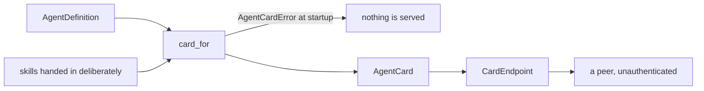

# Agent cards

Agents already call each other. What one may call on another lives in a README, in a Slack
thread, or in the other team's source, so a caller finds out that a skill was removed by
getting a runtime error — the latest possible moment to find out.

An agent card is that surface as data: who the agent is, what it can be asked to do, with
which schemas, under which scopes, and what it holds to. It is served at
`/.well-known/agent-card.json`, and every field on it is generated from the
`AgentDefinition` and the tools themselves. Nothing on a card is hand-maintained, because a
document written beside an implementation is a document that drifts away from it.



## Publishing

```python
from tesserix_adk.a2a import CardEndpoint, card_for

card = card_for(definition, audience="https://booker.example.gov", exports=(price_leg, refund))
endpoint = CardEndpoint(card)   # mount on any ASGI application
```

`exports` is the whole of the export control: a skill that is not handed in is not on the
card and is not named on it. Default-deny, so an internal tool stays internal by
construction rather than by remembering to exclude it.

| Argument | Effect |
|---|---|
| `definition` | The reviewed agent. Names, versions, scopes, approval and idempotence all come from here. |
| `audience` | What a credential for this agent is minted for. |
| `exports` | The skills deliberately published, as the tools themselves. |
| `accepted_issuers` | Which callers it takes delegations from. Empty accepts any, as a statement rather than a default. |
| `calls_per_minute` | A rate the deployment enforces. Absent where nothing enforces one — the kit does not publish a number nobody holds to. |
| `available` | Whether it is serving normally. |

## What a card refuses to say

A card is served to strangers, so it carries what a peer needs in order to call correctly
and nothing about how the agent is built.

| Not on the card | Why |
|---|---|
| Instructions, model, task budget | How the work is done is not how it is called. |
| The owner's paging address | A card is unauthenticated; an address published there is an address that gets scraped. `AgentProvider` names the team and the service instead. |
| Tenants, cost internals, internal endpoints | Facts about other people's use of the agent. |
| Any unexported tool | Absent by construction, and unnamed even in a refusal. |

## Failing at startup, not at the first peer

`card_for` raises `AgentCardError`, naming the skill, when a card could not be published
honestly: an export the agent may not call, a skill with no description, arguments that are
not a JSON object, more than `MAX_SKILLS` skills, or a card over `MAX_CARD_BYTES`. Raising
at generation means a deployment fails to start rather than serving a card that peers then
call incorrectly.

`adk card` renders the card, and `adk card --lint` reports what a peer would receive —
skills, scopes, approval gates and the size against the ceiling — so publishing is
checkable from a terminal before it is checkable from production.

## Serving it

`CardEndpoint` is an ASGI application with no framework dependency. It answers `GET` and
`HEAD` at its path, `405` to anything else, `404` elsewhere, and `304` to a conditional
request whose `If-None-Match` matches, so a peer that polls costs a conditional request
rather than a card. `serve(card)` replaces what is published: a degraded agent republishes
with `available=False` and tightened limits rather than advertising capability that will
fail, and the ETag change is what a polling peer notices.

## Compatibility

A card is a contract, and it versions with the agent it describes — `card.version` is
`agent.version`, so two versions behind one host publish two cards and a caller can pin.

| Change | Kind |
|---|---|
| Adding a skill, adding an optional field, widening what a schema accepts | Minor |
| Removing a skill, narrowing a schema, adding a required argument, adding a required scope | Breaking: bump the major version and keep the old version served for the deprecation window in [versioning.md](versioning.md) |

## Reading someone else's card

A description on another team's card is text that team wrote, and a card fetched from a
peer is data from outside your trust boundary. Treat every string on it as data: never
concatenate a peer's skill description into a system instruction, and never let it decide
what your agent does. What it is for is building a request and checking a schema.

## Known limitations

- Discovery is out of scope here: publishing the card to a registry is
  [#83](https://github.com/tesserix/agent-development-kit/issues/83), and calling a peer
  from its card is [#81](https://github.com/tesserix/agent-development-kit/issues/81).
- `MAX_CARD_BYTES` is a ceiling, not pagination. An agent with more than `MAX_SKILLS`
  skills is refused rather than trimmed, because a silently trimmed card is a card that
  lies about what an agent can do.
- `calls_per_minute` is whatever the deployment says it is. The kit does not measure it
  and cannot enforce it from here.
- Availability is republished by the deployment. Nothing here polls the agent's own health.
