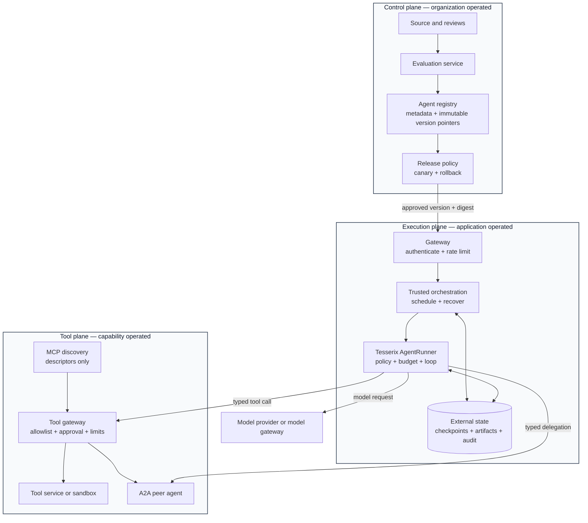
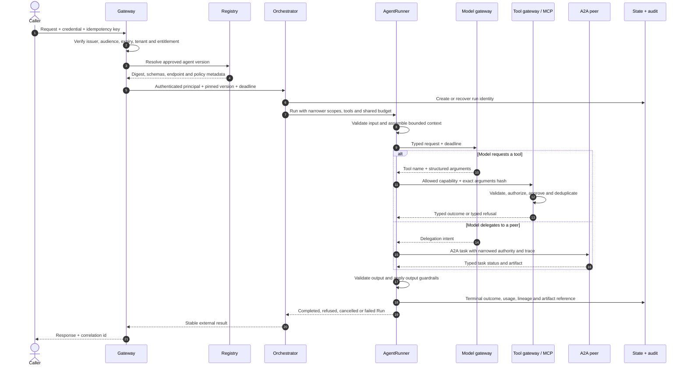
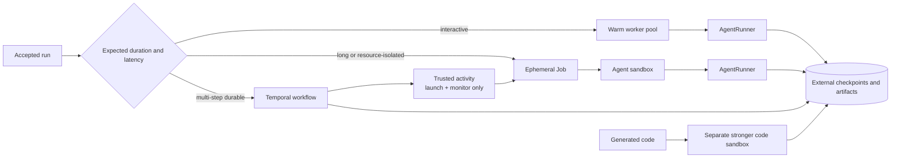

# Agent lifecycle and platform architecture

This page is the end-to-end design for taking an agent from source code to a monitored,
reversible production release. It also marks the boundary between the
`tesserix-adk` Python library and the platform an organization operates around it.

The governing rule is simple: authoring and evaluation produce an approved, immutable
agent version; execution consumes that version under a narrower runtime authority. A
runtime never edits the definition it is executing, and a registry never executes tool
code.

## The complete lifecycle

```mermaid
flowchart LR
    classDef author fill:#e8f1ff,stroke:#2457a7,color:#102a43,stroke-width:1.5px
    classDef gate fill:#fff4d6,stroke:#a46700,color:#4f3500,stroke-width:1.5px
    classDef approved fill:#e8f7ee,stroke:#247a46,color:#123b25,stroke-width:1.5px
    classDef runtime fill:#f0eaff,stroke:#6542a6,color:#2e1f4f,stroke-width:1.5px
    classDef signal fill:#fbe9ee,stroke:#a63d5b,color:#541f31,stroke-width:1.5px

    A[Agent source<br/>definition · prompts · schemas]:::author --> B[Static checks<br/>types · policy · dependencies]:::gate
    B --> C[Deterministic tests<br/>tools · failures · replay]:::gate
    C --> D[Model evaluations<br/>quality · cost · latency]:::gate
    D --> E[Security evaluations<br/>injection · tenancy · authority]:::gate
    E --> F{Quality gates}:::gate
    F -->|pass| G[Approved registry version<br/>digest · owner · eval evidence]:::approved
    F -->|fail| A
    G --> H[Canary deployment]:::runtime
    H --> I{SLO and policy gates}:::gate
    I -->|promote| J[Production runtime]:::runtime
    I -->|rollback| G
    J --> K[Traces · audit · outcomes<br/>cost · drift · feedback]:::signal
    K --> A
```

Each arrow has evidence:

| Transition | Required evidence | Failure behavior |
|---|---|---|
| Source → static checks | Strict types, schema admission, lint, dependency and secret checks | Reject the change |
| Static → deterministic tests | Offline tool loop, typed failures, idempotency, cancellation and recovery cases | Reject the change |
| Deterministic → model evaluations | Versioned dataset, graders, baseline, cost and latency ceilings | Reject or request review |
| Evaluations → approved registry version | Definition digest, owner, compatibility declaration and immutable evidence links | No version is published |
| Registry → canary | Signed or otherwise verified artifact and deployment intent | Refuse unknown or drifting metadata |
| Canary → production | Error, latency, cost, safety and quality objectives hold for the observation window | Automatic or one-action rollback |
| Production → authoring | Redacted traces, audit outcomes, user feedback and drift signals | Never copy secrets or raw untrusted content into source |

## Three planes, one narrow contract

The control plane is not part of the base Python package. The kit supplies the types,
evaluation primitives, descriptors, verification hooks and release checks that a control
plane can consume. GitHub Actions and GitHub Pages are the reference control plane for
this repository; a product can connect its own registry and gateway.

The registry stores metadata and pointers: name, version, digest, schemas, capabilities,
owner, endpoints, policy requirements and evaluation evidence. It does **not** store or
execute arbitrary MCP server code. MCP discovery returns capability descriptors; the
reviewed endpoint remains independently deployed and the gateway enforces the call.

## What the kit owns and what the platform owns

| Concern | `tesserix-adk` library | Application or platform |
|---|---|---|
| Agent contract | `Agent[Output]`, additive `TypedAgent[Input, Output]`, reviewed definitions and schemas | Source ownership and review |
| Model access | Provider protocol, capabilities, routing, usage and typed failures | Endpoint, credentials, quotas and data-residency policy |
| Tools | Typed definitions, registry views, admission, approval metadata, idempotency and timeouts | Tool deployment, network policy and downstream transaction |
| Peer agents | Tesserix typed delegation and official A2A adapters | A2A authentication, durable task store, endpoint and entitlement policy |
| Evaluation | Dataset, grader, baseline and result primitives; CLI/offline fakes | Evaluation corpus ownership, judge credentials and promotion threshold |
| Registry | Stable descriptors, fingerprints and vendor-neutral protocols | Durable database, signing, retention, replication and operator UI |
| Execution | Runner loop, budgets, guardrails, cancellation, outcomes and checkpoints | Process model, queue, Kubernetes Jobs/warm pools and autoscaling |
| Identity | Principal, tenant, scope narrowing and credential references | Identity provider, token verification, workload identity and rotation |
| Observability | Traces, metrics, audit/event contracts and redaction | Collectors, retention, alerting, incident response and access control |
| Release | Compatibility, dependency, schema and release verification tools | Branch rules, artifact signing, canary controller and rollback |

This separation keeps the package lean. Installing a provider or store extra does not
silently deploy a gateway, registry, queue, database or Kubernetes controller.

## One production invocation

Important distinctions:

- An MCP call invokes a capability. An A2A call delegates a task to an independently
  addressable agent. An A2A peer must not be flattened into an ordinary model-selected
  tool when task lifecycle, identity or cancellation matters.
- Identity, delegated authority and credentials are separate. A verified `Principal`
  identifies the caller; scopes describe what the call may do; short-lived credential
  references are resolved only at the outbound boundary.
- Authority only narrows. Every gateway, supervisor, agent and tool view intersects its
  policy with what the caller already holds.
- Approval binds the exact canonical argument hash. Editing arguments after approval
  creates a different action and requires a new decision.
- Run, job, tool-call and downstream-effect identifiers are idempotent correlation keys,
  not claims of exactly-once delivery.

## Interactive and long-running execution

The library does not require Kubernetes or Temporal. A production platform can select the
smallest execution model that meets its recovery and latency needs.

- Warm pools minimize interactive startup latency. They still keep run state external
  when a restart must be recoverable.
- Ephemeral Jobs bound CPU, memory, filesystem, service account and network access for
  long work. Default-deny egress is the baseline; capability-specific egress is explicit.
- A Temporal worker is trusted orchestration code. It launches and monitors an isolated
  Job; it does not execute model-generated code or arbitrary agent code inside the worker.
- Generated code uses a separate, stronger sandbox from the normal agent process. It gets
  no ambient cloud credential, writable host path or unrestricted network.
- Projected workload identity is short-lived and audience-bound. Long-lived keys, prompts
  and credentials do not belong in environment variables or container images.

## Providers, gateways, registries and protocols

The same `ModelProvider` contract covers OpenAI, Anthropic, Gemini, Groq, xAI/Grok,
OpenRouter, vLLM, Ollama, TGI, llama.cpp and organization-specific gateways. Capability
declarations—not provider names—decide whether a model can perform a task. A custom
provider implements the protocol and passes the conformance suite.

The connection rules are:

1. Use a provider adapter or compatible gateway for model inference.
2. Use MCP for discoverable tools and resources, with schema admission and a tool gateway.
3. Use official A2A for independently deployed agents and task lifecycle.
4. Use `A2ARegistry` or an application adapter for any registry; pin descriptors/digests
   and reject drift before execution.
5. Keep credentials at the outbound adapter. Do not copy them into agent definitions,
   registry metadata, prompts, A2A messages or MCP arguments.

See [Provider recipes](provider-recipes.md), [Integrations and gateways](integrations.md),
[Framework interoperability](framework-interop.md),
[Official A2A interoperability](a2a.md), [Google Agent Development Kit
interop](google-adk.md), and [Migrate an existing agent](migration.md).

## Recovery and failure semantics

| Failure | Required behavior |
|---|---|
| Unsupported provider capability or schema | Fail before a paid or effectful call |
| Policy, identity, budget or credential service unavailable | Fail closed |
| Trace or metrics exporter unavailable | Preserve execution; buffer/drop under an explicit bound |
| Tool timeout after an effect may have started | Record an indeterminate outcome; retry only with a downstream idempotency key |
| Duplicate delivery | Resolve the same run/tool/effect identity and return the recorded outcome |
| Worker crash | Recover from external checkpoint/journal; never invent completion |
| Registry descriptor drift | Refuse the unpinned version |
| Canary regression | Stop promotion and execute the documented rollback |
| Foreign agent or retrieved artifact | Treat as untrusted data until schema, policy and guardrails pass |

## Release-ready checklist

Before promoting an agent version, answer yes to each item:

- Is the input, output, tool and public Agent Card schema explicit and versioned?
- Are provider capabilities and context limits facts for the deployed model?
- Do deterministic tests cover timeout, cancellation, duplicate delivery, invalid schema,
  budget exhaustion, guardrail refusal and another-tenant access?
- Do versioned evaluations measure quality, cost and latency against a reviewed baseline?
- Is every effect idempotent or explicitly non-repeatable, and is approval argument-bound?
- Are A2A and MCP identities verified outside model-controlled payloads?
- Are checkpoints, artifacts, audit records and traces externally retained for the stated
  recovery and compliance window?
- Does the deployment use short-lived identity, default-deny networking, resource limits
  and a separate generated-code sandbox where applicable?
- Is canary rollback one action, and has recovery been exercised rather than documented
  only?

The [testing guide](testing.md), [evaluation datasets](eval-datasets.md), [threat
model](threat-model.md), [durable runs](durable-runs.md), and [release
verification](verifying.md) provide the implementation-level checks.
