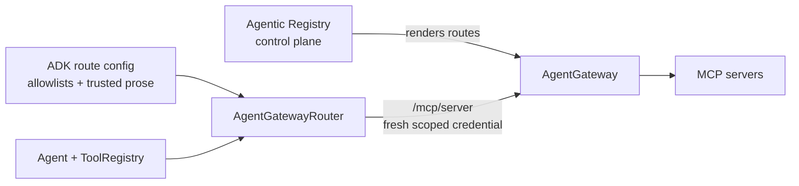

# AgentGateway MCP routing

`AgentGatewayRouter` gives one agent a fixed, tenant-safe MCP tool surface through
AgentGateway. The Agentic Registry remains the control plane: it renders and reconciles
gateway routes, while the ADK receives operator-approved route configuration at startup
and never queries the registry during discovery or a tool call.



This split keeps a registry outage out of the call path. There is deliberately no direct
MCP-server fallback: bypassing AgentGateway would also bypass its authentication, policy,
rate limiting, and telemetry.

## Configure and adopt tools

Install the optional integration first:

```bash
uv add 'tesserix-adk[mcp]'
```

Build configuration from the same deployment source that owns the Agentic Registry and
AgentGateway declarations. Each description is operator-authored text that may enter a
model prompt; each tool and scope is an explicit allowlist.

```python
from tesserix_adk.adapters import McpStreamableHttpTransport, agent_gateway_tools
from tesserix_adk.mcp import (
    AgentGatewayConfig,
    AgentGatewayRoute,
    AgentGatewayRouter,
    AgentGatewayToolConfig,
)
from tesserix_adk.tools import ToolRegistry

config = AgentGatewayConfig(
    base_url="https://agentgateway.internal.example",
    routes=(
        AgentGatewayRoute(
            server="bookings",
            audience="https://bookings.mcp",
            scopes=("bookings:read", "bookings:write"),
            tools=(
                AgentGatewayToolConfig(
                    name="get_booking",
                    description="Look up one booking by its identifier.",
                    scopes=("bookings:read",),
                    requires_approval=False,
                ),
                AgentGatewayToolConfig(
                    name="cancel_booking",
                    description="Cancel a booking after the caller approves the action.",
                    scopes=("bookings:write",),
                ),
            ),
        ),
    ),
)

router = AgentGatewayRouter(
    config,
    credentials=credential_source,
    transport=McpStreamableHttpTransport(),
)
routed = await router.tools_for(identity=identity, run_id=run_id, agent_version=agent_version)
adopted = agent_gateway_tools(routed)
registry = ToolRegistry(adopted)
```

Pass `registry` into the normal agent/runtime composition. Tools are exposed as
`bookings__get_booking` and `bookings__cancel_booking`, so two servers cannot collide.
Call `release()` on each adopted tool when its registry is retired, as for any other ADK
tool.

## Security and failure behaviour

- Discovery and every invocation mint a new credential narrowed to caller, audience,
  route, and tool scopes. A session lease is keyed by server, tenant, and subject.
- Tools outside the caller's effective scopes are absent. A remotely advertised tool
  that is not operator allowlisted is ignored; a configured tool missing remotely fails
  discovery closed.
- Remote descriptions, annotations, defaults, examples, and other schema prose are
  stripped before the declaration enters a prompt. The original bounded JSON Schema is
  retained only for argument validation, and non-local `$ref` values are refused.
- Gateway outages, malformed discovery, MCP tool errors, and payload ceilings become
  redacted `McpGatewayError` values. Only `UNAVAILABLE` is marked retryable; the router
  itself never retries.
- Defaults are 40 exposed tools, a 15-second operation timeout, a 256 KiB result, a
  32 KiB/depth-16 schema, and the tool layer's 64 KiB strict argument limit.

Construct one tool set per run and keep it pinned for that run. Rebuilding it is the
explicit point at which a reconciled route or allowlist change becomes visible.

For a network-free executable composition, run
`uv run --extra mcp python examples/agentgateway.py`.
