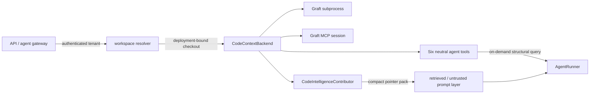

# Code intelligence

Code intelligence gives an agent a map of source code before it starts opening files at
random. The ADK keeps the capability backend-neutral and ships adapters for
[Graft](https://github.com/nanonets/graft), whose structural graph records symbols,
definitions, call/reference/import edges, file APIs, and repository hotspots.

This is not the episodic knowledge graph in `GraphMemoryStore`. Graph memory records facts
learned during runs. Code intelligence describes one current source checkout and is rebuilt
from that checkout.

## The useful idea in Graft

A cold coding agent repeatedly pays to rediscover the same architecture. Graft builds a
local, regenerable graph once and provides two retrieval styles:

- **push** — `graft ask --source` supplies a small ranked pointer pack before the model
  reasons; this reduces exploratory reads and improves time to first useful action;
- **pull** — six structural tools let the model ask for a file API, trace callers, search
  every occurrence, or inspect the repo map only when the task requires it.

The ADK supports both at once. `CodeIntelligenceContributor` performs the compact push;
`code_intelligence_tools` supplies the pull surface. The pushed content enters the existing
`RETRIEVED` prompt layer, wrapped as untrusted data. It cannot replace system instructions
or tool declarations.



The model sees `code_find`, `code_file_api`, `code_trace`, `code_find_all`,
`code_repo_map`, and `code_check_freshness`. It never sees a tenant or workspace argument.

## Local Graft

Install and build Graft in the checkout managed by the gateway or worker:

```bash
npm install -g @nanonets/graft
cd /srv/checkouts/acme/payments
graft build
graft check
```

Plain `graft build` and all six query operations are structural. They do not need a model
or provider key. `graft build --deep` adds Graft's model-written summaries and cruxes; run
that as an explicit indexing job with secrets supplied by the deployment, never implicitly
from an agent request.

Bind the canonical checkout after the gateway has authenticated and authorized the caller:

```python
from tesserix_adk.adapters import GraftSubprocessBackend
from tesserix_adk.code_intelligence import CodeIntelligenceContributor, CodeWorkspace
from tesserix_adk.tools import ToolRegistry, code_intelligence_tools

workspace = CodeWorkspace(
    id="payments-main",
    tenant="acme",
    root="/srv/checkouts/acme/payments",
)
backend = GraftSubprocessBackend(
    ("graft",),
    workspace=workspace,
    timeout_seconds=15,
    max_output_chars=256_000,
)

declared = code_intelligence_tools(backend)
registry = ToolRegistry(declared)
tools = registry.view(allow=registry.names, agent="developer")
contributor = CodeIntelligenceContributor(backend, limit=3)
```

The subprocess adapter resolves the root once, uses it as `cwd`, passes every query as one
argv value without a shell, reads stdout and stderr concurrently, and enforces a deadline
and output ceiling. Exit status `1` is accepted only for `code_check_freshness`, where it
means the graph is stale.

## MCP-backed Graft

For a gateway that already manages MCP processes, start one Graft server rooted at the
authorized checkout:

```bash
graft mcp /srv/checkouts/acme/payments
```

Any MCP client session exposing `call_tool(name, arguments)` can back the same ADK surface:

```python
from tesserix_adk.adapters import GraftMcpBackend

backend = GraftMcpBackend(
    session,
    workspace=workspace,
    max_output_chars=256_000,
)
```

The adapter translates the neutral names to Graft's current MCP tools:

| ADK tool | Graft MCP tool | Use |
|---|---|---|
| `code_find` | `graft_find_code` | ranked source excerpts for a question |
| `code_file_api` | `graft_file_api` | signatures and spans without bodies |
| `code_trace` | `graft_trace_calls` | callers, dependencies, or transitive blast radius |
| `code_find_all` | `graft_find_all` | exhaustive regex/literal search grouped by symbol |
| `code_repo_map` | `graft_repo_map` | directory clusters, hubs, and hotspots |
| `code_check_freshness` | `graft_check_freshness` | working-tree drift report |

Keep the MCP session bound to one checkout. Do not multiplex a session by accepting a root
path from the model. A pool may be keyed by an authorization result held by the gateway,
not by a model-provided tenant or workspace string.

## Attach it to an agent

Use the same backend for automatic context and tools so both surfaces observe the same
checkout:

```python
from tesserix_adk.core import Agent
from tesserix_adk.runtime import AgentRunner

agent = Agent(
    name="developer",
    instructions="Make the smallest safe change and trace its callers first.",
    model="configured-model",
    tools=tools.names,
    free_text=True,
)
runner = AgentRunner(
    provider=provider,
    tools=tools,
    context_contributors=(contributor,),
)
run = await runner.run(agent, "Fix authorization caching", tenant="acme")
```

`examples/code_intelligence.py` runs this complete flow with an in-process backend so the
example needs neither Graft nor credentials. Replace that backend with either Graft adapter
above in a deployment.

## Gateway and tenancy rules

The gateway owns the mapping from the authenticated principal to `CodeWorkspace`. A safe
request path is:

1. authenticate the caller and derive the tenant server-side;
2. authorize the requested repository for that tenant;
3. resolve or provision its checkout and canonical root;
4. construct or select the backend already bound to that workspace;
5. run the agent with the authenticated tenant in `ToolContext` and `ContextRequest`.

Both adapters verify tenant and workspace on every call. A mismatch raises the generic
`CodeWorkspaceNotFoundError("code workspace not found")`, so another tenant cannot use the
error to discover whether a checkout exists. Relative file and path inputs reject absolute,
parent-traversing, and Windows drive-qualified paths.

Treat source excerpts as sensitive and untrusted. The runtime records contributor name,
status, and admitted segment count, never source text or backend error messages. Keep
checkout access, MCP process permissions, and logs inside the same tenant boundary.

## Outages, freshness, and cost

An optional contributor defaults to a cold run when Graft is unavailable and emits
`CONTEXT_DEGRADED`. Set `required=True` only for an agent that must not reason without its
authorized code map; then the run fails before model egress. Direct tool calls fail normally
at the tool boundary.

Graft refreshes structural query data before `find`, `file_api`, `trace`, `find_all`, and
`repo_map`. Freshness is deliberately different: it reports drift without first repairing
it. Build the graph during checkout provisioning and run `graft check` in the worker health
path or CI.

Do not assume upstream benchmark savings transfer unchanged. Measure cold versus enabled
runs on representative tasks using input tokens, tool calls, time to first useful action,
task correctness, optional-degradation rate, and stale-graph rate. Keep the contributor
pack small (three results is the default); use the pull tools for exhaustive work.
