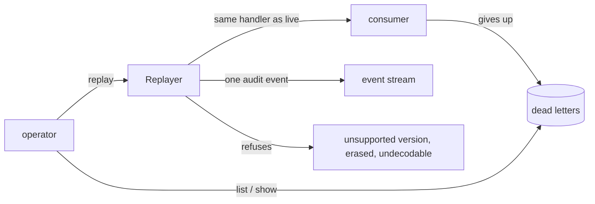

# Dead letters: seeing what failed, and putting it back

Every consumer in this kit can bury an event it cannot handle: `IdempotentConsumer` after
`max_attempts`, `DurableConsumer` on a poison message, `OutboxRelay` on a row that is not an
envelope. Burying it stops the redelivery loop, which is the immediate problem. It does not
answer the two questions that follow: what is in there, and how does it get processed once
the bug is fixed.

The answer is usually a script. Somebody reads the stream by hand and reprocesses with code
that has none of the idempotency the live path has — and the recovery becomes the second
incident, with double charges where the first one had none.

This module removes the reason to write that script.



## Inspecting

```python
from tesserix_adk.adapters import DeadLetterQuery, InMemoryDeadLetters, Replayer

letters = InMemoryDeadLetters(clock=clock)
consumer = IdempotentConsumer(
    handle, store=store, group="billing", dead_letter=letters.for_group("billing")
)

records = await replayer.records(DeadLetterQuery(tenant="acme", group="billing", limit=50))
for record in records:
    print(record.inspected())
```

`inspected()` renders identifiers, counts and timings, plus the *names* of the envelope's
attributes. It never renders an attribute value. A listing of a day's failures on a terminal
is otherwise a second copy of the data that failed, in a scrollback nobody governs.

`last_error` is the exception type. `ValueError: card 4111 1111 1111 1111 declined` is
recorded as `ValueError`.

## Replaying

```python
replayer = Replayer(letters, handler=consumer.handle, clock=clock, eventing=eventing)

plan = await replayer.plan(query)
report = await replayer.replay(query, operator="ada", reason="consumer_fixed")
```

The handler is the live consumer path, not a copy of it. Wrapping `IdempotentConsumer.handle`
means an event that was already applied is *suppressed* rather than applied twice, using the
same dedupe marker the broker's own redelivery would hit.

An event the consumer *gave up on* is different: its poison marker is a decision, and a
replay is an operator overturning it, so it is handled again. A marker saying the handler
already ran still suppresses, replay or not — that is the double charge it exists to
prevent.

From a terminal:

```
adk dead-letters list   --tenant acme --group billing
adk dead-letters show   --tenant acme --event-id 01J...
adk dead-letters replay --tenant acme --by ada --dry-run
adk dead-letters replay --tenant acme --by ada --reason consumer_fixed
```

## The guardrails

**One tenant.** `DeadLetterQuery` cannot be built without a tenant, and `Replayer` raises
`ScopeViolationError` if the store hands back a record belonging to anyone else. A replay is
the one operator action that reaches into a consumer's effects; it does not reach across a
boundary because a query was written loosely.

**A capped batch.** `limit` defaults to 100 and cannot exceed `MAX_REPLAY_BATCH`. Every report
carries `remaining`, so a backlog is paged and watched rather than pushed through the live
consumers in one go.

**A marker on every envelope.** Each redelivered envelope carries `replay_id`; live traffic
carries an empty one. A consumer that must behave differently under replay — suppressing a
customer email, say — has something to branch on, and a downstream trace shows where the
traffic came from. The event id is unchanged, so dedupe still works.

**Refusals rather than guesses.** A record is refused, by name, when it is not an envelope
this kit can read (`undecodable`), when its schema version is one this build does not
support (`unsupported_version`), or when the scope it refers to has since been erased
(`erased`). A refusal does not stop the batch.

**Failures stay put.** A handler that raises again leaves the record where it was, with its
attempt count incremented. Only a delivery the handler accepted is forgotten.

**An audit record.** Each replay emits one `EventsReplayed` event carrying the replay id, the
record count, the group, the approver and a reason code — and no payload content. Who
reprocessed what, and when, is the first question an incident review asks.

## Metrics and alerting

`stats(tenant)` gives the two numbers worth watching, plus the arrival counter for a rate:

```python
stats = await letters.stats("acme")
gauge("adk.dead_letters.buried", stats.buried, tenant="acme")
gauge("adk.dead_letters.oldest_seconds", stats.oldest_seconds, tenant="acme")
counter("adk.dead_letters.arrivals", stats.arrivals, tenant="acme")
```

Recommended alerts:

| Alert | Condition | Why |
|---|---|---|
| Dead letters arriving | `rate(arrivals[5m]) > 0` for 10 minutes | A consumer has started failing; the backlog is the symptom, the deploy is usually the cause. |
| Backlog ageing | `oldest_seconds > 86400` | Something was buried and nobody looked. Records do not expire, so this only grows. |
| Backlog growing | `buried` rising for an hour | Retries are not going to fix it; a human has to decide. |

`buried` alone is a poor page — one record is normal. The arrival *rate* is what distinguishes
a bad message from a bad deploy.

## What this is not

It is not a retry policy. Retries belong in the consumer, before it gives up; by the time a
record is here, a human has to decide.

It is not durable on its own. `InMemoryDeadLetters` is the reference implementation and dies
with the process. A deployment that must survive a restart implements `DeadLetterStore`
against its own database; nothing above the protocol changes.

It cannot make a non-idempotent handler safe. If the handler has no dedupe marker, a replay
applies the effect again — as would the broker's own redelivery. See
[`docs/idempotency.md`](idempotency.md).
