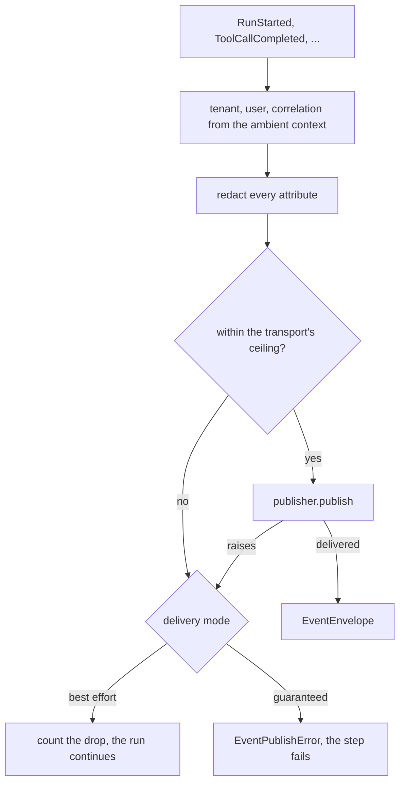

# Events

Every product otherwise wires its own notifications for a run starting and finishing and for
the tool calls in between: a log line here, an ad-hoc publish there. Nothing downstream — a
dashboard, cost reporting, support tooling — can consume agent activity uniformly, and the
payloads that do exist have already carried message content into stores somebody later
queries.

An event here is an envelope with a body drawn from a fixed allowlist of identifiers, counts
and spend. There is no field a prompt, a tool argument or a retrieved passage could travel
in. Publishing is optional: the default publisher publishes nowhere.



## Emitting

```python
from tesserix_adk.core import Delivery, Eventing, RunStarted

eventing = Eventing(publisher, clock=clock, delivery=Delivery.BEST_EFFORT)
await eventing.emit(RunStarted(run_id=run_id, agent="planner", model="claude-sonnet-5"))
```

No publish site passes scope. The tenant, the user and the correlation id come from the
ambient `tenant_scope`, the span from whatever span is open, and emitting outside any tenant
is a `ConfigurationError` rather than an event nobody can attribute.

`emit_all` publishes a batch as one call. An event over the ceiling is left out of the batch
rather than taking the rest of it down, and the `PublishReport` names what did not go.

## The catalogue

| Event | Carries |
|---|---|
| `RunStarted` | run, agent, agent version, model, session |
| `RunCompleted` | run, iterations, tool and model calls, tokens, cost, duration |
| `RunFailed` | run, error code, attempt |
| `RunCancelled` | run, reason code |
| `ToolCallRequested` | run, tool, call id, attempt |
| `ToolCallCompleted` | run, tool, call id, state, duration, error code |
| `ApprovalRequested` | run, approval id, tool |
| `ApprovalDecided` | run, approval id, decision, approver |
| `BudgetExceeded` | run, scope, limit, cost |
| `MemoryErased` | subject, records erased, run |

Every envelope carries a ULID `event_id` that sorts by the moment it was created, the
`schema_version` a consumer branches on, `occurred_at`, the tenant and user scope, the run
and trace, the span, the caller's `correlation_id`, and the `causation_id` of the event this
one followed from.

## Republishing a watched run

```python
from tesserix_adk.adapters import publishing

async for event in publishing(stream, eventing):
    render(event)
```

Progress is for whoever is watching the run right now; an event is for systems that were
not. `publishing` yields every progress event through untouched and publishes the ones
another system acts on — a delta, an iteration and a usage update are not among them.
`payload_of` is the mapping on its own, for a consumer bridging progress somewhere else.

## What may not travel

`ALLOWED_ATTRIBUTES` is the whole vocabulary an event body may use: identifiers, counts, the
model and what it cost. A payload declaring anything else is a `ConfigurationError` when it
is emitted, not a review comment somebody might miss. Every attribute is then redacted
before the publisher sees it, so an identifier that reached an attribute by accident is gone
before anything can store it.

## Delivery

| Mode | A publisher that cannot deliver |
|---|---|
| `best_effort` | Counted on `Eventing.dropped`; the run continues |
| `guaranteed` | `EventPublishError`; the step fails, so a state change and its event cannot diverge |

Ordering is per run. A publisher may reorder events from different runs and must not reorder
one run's; a consumer that needs more than that sorts by `event_id`.

## Known limitations

- The kit ships no broker adapter here. `EventPublisher` is the whole contract, and
  `NullEventPublisher` is the default.
- Guaranteed delivery is not a transaction. The publish happens after the state change, so
  the failure it prevents is a silent divergence, not a partial one.
- `emit_all` is one broker call, so a publisher that fails a batch fails all of it. What
  partial delivery means is the publisher's own business.
- An event over the ceiling is refused rather than trimmed. Publish an identifier and let
  the consumer fetch the rest.
