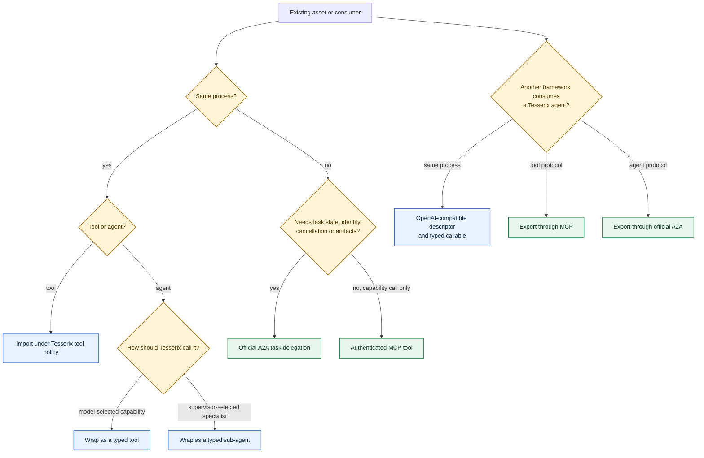
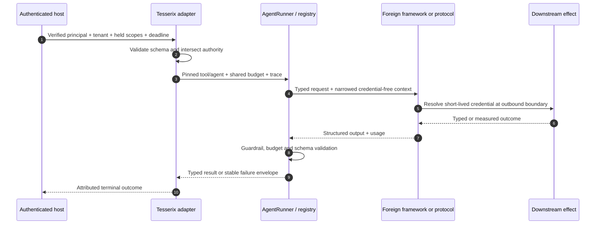

# Framework interoperability

Use this guide when a useful tool or agent already exists in another framework, or when
another runtime needs to consume a Tesserix agent. The adapter should preserve the
smallest boundary that carries the required lifecycle. It should not pretend that two
frameworks have the same policy, identity, state, or recovery model.

The model provider remains independent of every choice on this page. A wrapped or
exported Tesserix agent can run on OpenAI, Anthropic, Gemini, Groq, xAI/Grok, OpenRouter,
a local model, a compatible gateway, or any conforming `ModelProvider`.

## Choose one boundary



| Situation | Public surface | What remains outside the adapter |
|---|---|---|
| Import a typed callable, class tool, or OpenAI function descriptor | `import_tool` / `import_toolset` | Foreign implementation and its downstream credentials |
| Import a Google `FunctionTool` | `import_google_adk_tool` / `import_google_adk_toolset` | Google function body and any application services it calls |
| Call an existing agent as one model-visible capability | `wrap_agent_as_tool` | Foreign runtime internals and credentials |
| Add an existing agent to a supervisor roster | `wrap_agent_as_subagent` | Foreign runtime internals and credentials |
| Add a Google `BaseAgent` to a Tesserix supervisor | `wrap_google_adk_agent` plus `GoogleAdkAgentInvoker` | Google Runner, sessions, plugins, artifacts and credentials |
| Give an in-process framework a callable Tesserix agent | `export_as_tool` | Host authentication and transport |
| Publish a Tesserix agent as an authenticated capability | `export_as_mcp_tool` | MCP transport host, authentication and durable effects |
| Publish a Tesserix agent with task lifecycle | `export_as_a2a` | A2A routes, authentication, task store, subscriptions and recovery |

MCP invokes a capability. Official Agent2Agent (A2A) delegates a task to an independently
addressable agent. Use A2A when task identity, progress, cancellation, durable state,
artifacts, or agent discovery crosses a process boundary. Do not flatten that lifecycle
into an MCP function merely because both protocols can carry JSON.

## Import a foreign tool

The generic importer accepts a typed callable, a common class-tool shape, an OpenAI
function descriptor paired with an implementation, or an already translated Tesserix
tool. Admission happens before registry registration.

```python
from tesserix_adk.adapters import ToolImportPolicy, import_tool
from tesserix_adk.core import Idempotency
from tesserix_adk.tools import ToolContext


async def catalog_search(*, query: str, context: ToolContext) -> dict[str, object]:
    return {"tenant": context.tenant, "query": query, "items": []}


search_tool = import_tool(
    catalog_search,
    policy=ToolImportPolicy(
        timeout_seconds=5,
        max_concurrency=4,
        requires_approval=False,
        idempotency=Idempotency.READ_ONLY,
    ),
    provenance="legacy-catalog:v1",
)
```

`ToolImportPolicy` deliberately has no idempotency default. Unsupported JSON Schema,
missing caller-context propagation, duplicate names, ambiguous implementations, or
undeclared repeat behavior raises `ToolTranslationError` before the foreign body runs.
The resulting tool still receives Tesserix argument validation, approval, concurrency,
timeout, attribution and registry allowlisting.

For a Google `FunctionTool`, install `tesserix-adk[google-adk]` and use
`import_google_adk_tool` or `import_google_adk_toolset`. The Google invocation surface is
retained, while the ephemeral Google tool context receives only credential-free run,
tenant, user, narrowed scope, and W3C trace state. See the [Google Agent Development Kit
bridge](google-adk.md#import-existing-google-functiontools).

## Wrap a foreign agent

Use a typed tool when the parent model may select the capability. Use a typed sub-agent
when deterministic supervisor routing selects a specialist. Both wrappers validate input
and output, reserve projected usage before dispatch, share the caller's budget, narrow
scopes and tools, propagate cancellation and W3C trace context, enforce recursion and
timeout ceilings, and apply output guardrails.

```python
from pydantic import BaseModel, ConfigDict

from tesserix_adk.adapters import (
    ForeignAgentContext,
    ForeignAgentReply,
    WrappedAgentPolicy,
    wrap_agent_as_subagent,
    wrap_agent_as_tool,
)
from tesserix_adk.core import Idempotency, Usage


class ResearchRequest(BaseModel):
    model_config = ConfigDict(extra="forbid")
    question: str


class ResearchAnswer(BaseModel):
    model_config = ConfigDict(extra="forbid")
    answer: str


async def invoke_existing(
    request: ResearchRequest,
    context: ForeignAgentContext,
) -> ForeignAgentReply[ResearchAnswer]:
    context.raise_if_cancelled()
    raw = await existing_runtime.run(
        question=request.question,
        tenant=context.tenant,
        user=context.user,
        scopes=context.scopes,
        trace=context.trace,
    )
    return ForeignAgentReply(output=raw.output, usage=raw.usage)


policy = WrappedAgentPolicy(
    timeout_seconds=30,
    projected_usage=Usage(input_tokens=2_000, output_tokens=500),
    scopes=("research:read",),
    tools=("catalog_search",),
    requires_approval=False,
    idempotency=Idempotency.IDEMPOTENT,
)

research_tool = wrap_agent_as_tool(
    invoke_existing,
    name="legacy_research",
    input_type=ResearchRequest,
    output_type=ResearchAnswer,
    policy=policy,
)
research_specialist = wrap_agent_as_subagent(
    invoke_existing,
    name="legacy_research",
    input_type=ResearchRequest,
    output_type=ResearchAnswer,
    policy=policy,
)
```

`ForeignAgentContext` has no credential field. The application resolves credentials at
the foreign runtime's outbound boundary. A callback that ignores the supplied tenant,
scope, cancellation, or budget context cannot be made safe by the wrapper and must not be
admitted.

For a Google `BaseAgent`, use `wrap_google_adk_agent` with an application-owned
`GoogleAdkAgentInvoker`. That explicit callback is where the application retains its
Google Runner, tenant-scoped session service, plugins, artifacts and credential setup.

Effectful foreign work has an important uncertainty boundary: if cancellation or timeout
happens after dispatch and the outcome cannot be proven, the wrapper raises
`IndeterminateOutcomeError`. Retry only when the downstream operation has a stable
idempotency key that returns the original result.

## Export a Tesserix agent

All exports drive the normal `AgentRunner`; they do not create a second execution loop.
The agent must declare structured output so the foreign consumer receives a stable,
versioned `ExportedAgentResult` success-or-error envelope.

Direct and MCP function exports also need a request schema. Declare them with
`TypedAgent[InputT, OutputT]` or `TypedAgentDefinition[InputT, OutputT]`; the export invokes
`run_typed` and therefore keeps the same guardrails, budget, identity, trace and provider
path as a local run. Official A2A's text ingress continues to accept the stable
`AgentDefinition[OutputT]` contract.

### Direct descriptor and callable

```python
from tesserix_adk.adapters import ExportInvocation, export_as_tool
from tesserix_adk.core import Principal


exported = export_as_tool(
    runner,
    definition,
    name="research_agent",
    description="Answer one research question with cited evidence.",
    timeout_seconds=30,
)

descriptor_for_registry = exported.descriptor
pinned_fingerprint = exported.descriptor_fingerprint
exported.assert_descriptor(pinned_fingerprint)

result = await exported.invoke(
    {"question": "Where is Kyoto?"},
    ExportInvocation(
        tenant="acme",
        user="ada",
        scopes=("research:read",),
        trace={"traceparent": "00-..."},
        principal=Principal(
            subject="ada",
            tenant="acme",
            scopes=frozenset({"research:read"}),
        ),
    ),
)
```

Authentication is checked before arguments are parsed or provider work begins. The host
must build `ExportInvocation` from a verified identity, never from model-controlled
arguments. Consumers pin `descriptor_fingerprint`; drift raises
`ExportDescriptorDriftError` before the incompatible call.

Failures use stable codes such as `authorisation`, `budget_refusal`, `guardrail_block`,
`schema_violation`, `provider_outage`, and `timeout`. The envelope never copies provider
bodies, prompts, tool arguments, credentials, or partial output into its public message.

### MCP capability

```python
from tesserix_adk.adapters import export_as_mcp_tool


mcp_server = export_as_mcp_tool(
    runner,
    definition,
    name="research_agent",
    description="Answer one research question with cited evidence.",
    per_tenant_calls=8,
)
```

The returned server requires an authenticated tenant when the host connects a session.
The application still owns the stdio/HTTP host, authentication middleware, rate-limit
storage, downstream durability, and network policy. Export only the generated allowlisted
tool; do not expose the runner or raw provider client.

### Official A2A task

```python
from tesserix_adk.adapters import A2AInterface, A2ASkill, export_as_a2a


published = export_as_a2a(
    runner,
    definition,
    resolve=resolve_verified_principal,
    description="Answer research questions.",
    provider_url="https://agents.example.com",
    interfaces=(
        A2AInterface(
            url="https://agents.example.com/a2a/research",
            protocol_binding="JSONRPC",
        ),
    ),
    skills=(
        A2ASkill(
            id="research",
            name="Research",
            description="Answer one research question.",
            tags=("research",),
        ),
    ),
)
```

`published.card` is reviewed control-plane metadata; `published.executor` is the official
server executor. The application mounts official routes, verifies issuer/audience/expiry
and per-agent entitlement, resolves a core `Principal`, and supplies a tenant-scoped
durable `TaskStore`. The resolver also protects cancellation. See [Official A2A
interoperability](a2a.md) for the full support matrix.

## What crosses each boundary



| Context | Import/wrap | Direct/MCP export | Official A2A export |
|---|---|---|---|
| Tenant and user | Supplied by Tesserix caller | Verified by host and compared at ingress | Resolved from authenticated server context |
| Scopes and tools | Intersected with wrapper policy | Requested scopes must be held by principal | Resolver and application entitlement policy narrow them |
| Credentials | Never placed in foreign context | Never accepted in function arguments | Never accepted in task message metadata |
| Budget and usage | Shared ledger; measured usage or declared estimate | Shared narrower budget when supplied | Runner budget under authenticated task execution |
| Trace | W3C fields only | W3C fields only | Transport/server context into runner |
| Cancellation | Propagated; effect may become indeterminate | Cooperative token plus hard timeout | Official task cancellation with principal re-check |
| Descriptor/schema | Admitted before registry registration | Canonical descriptor and fingerprint | Reviewed Agent Card, explicit skills and interfaces |

Authority only narrows. If identity, policy, budget, capability admission, or schema
validation is unavailable, execution fails closed. Telemetry export may degrade under a
documented bound because observability is not authorization.

## Gateway and registry integration

A registry stores reviewed metadata and endpoints, never executable MCP code, provider
credentials, prompts, or private agent instructions. A gateway authenticates the caller,
applies rate and payload limits, and routes to a pinned descriptor. The in-flight run
continues against that pinned surface if the registry later becomes unavailable.

For a custom official A2A registry, implement `A2ARegistry.resolve(name)` and use
`a2a_client_from_registry`; verify signatures, issuer policy, endpoint allowlists, expiry,
and that the returned card name matches the requested name. For a custom gateway binding,
register the official SDK transport producer through `a2a_client_factory`. MCP gateways
use `McpTransport` or the documented AgentGateway route reconciliation. See [Integrations
and gateways](integrations.md#registries).

## Verification checklist

Before enabling an adapter in production:

- run its network-free positive, validation, timeout, cancellation, duplicate, budget,
  guardrail, and another-tenant tests;
- pin provider capabilities and imported/exported descriptors to the reviewed deployment;
- prove that unavailable identity, policy, budget, schema, or credential resolution fails
  before model or effectful work;
- prove that a timeout after an effect starts is either deduplicated downstream or recorded
  as indeterminate;
- keep credentials out of definitions, registry records, prompts, trace fields, MCP
  arguments, A2A messages, and `ForeignAgentContext`;
- assign ownership for authentication, persistence, subscriptions, crash recovery,
  cancellation, quotas, and rollback on the application side of the boundary;
- use the [staged migration path](migration.md) and compare quality, cost, latency, safety,
  and recovery evidence before removing the old route.

The [Google Agent Development Kit bridge](google-adk.md) gives the framework-specific
assembly, while [Agent lifecycle and platform architecture](agent-lifecycle.md) shows how
these boundaries fit between evaluation, registry approval, canary, execution, recovery,
and feedback.
