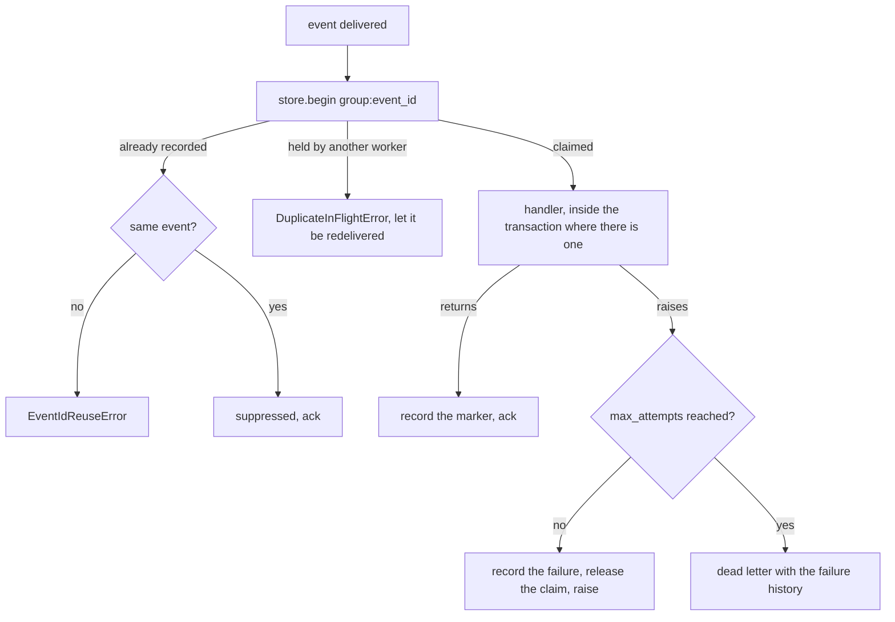

# Idempotent consumption

At-least-once delivery is not a setting anybody can turn off. The broker will hand the same
event over twice — after an ack timeout, a reaper requeue, or a rolling deploy — and whether
that is harmless depends entirely on whether the first handling left a record the second
delivery can see.



## Using it

```python
from tesserix_adk.adapters import DurableConsumer, IdempotentConsumer, RedisIdempotencyStore

once = IdempotentConsumer(
    charge_customer,
    store=RedisIdempotencyStore(redis, clock=clock),
    group="billing",
    ttl_seconds=86_400.0,
    redelivery_horizon_seconds=max_deliver * ack_wait,
    dead_letter=letters,
    transaction=session.begin,
)
consumer = DurableConsumer(subscription, handler=once.handle)
```

## What is guaranteed, and what is not

The marker suppresses a second **execution** within the retention window. The effect is
single only where the handler's own state change shares the transaction the marker is
written in — pass `transaction` and the two commit together, or the process can die between
them and leave the effect without its marker.

So the handler contract is: **effect-idempotent within the window**. Events for the same run
can also arrive out of order, and a handler must tolerate that; the stream orders nothing a
consumer group can rely on across partitions.

## Refusals, and why each is not a warning

| Refusal | Why |
| --- | --- |
| `ttl_seconds` under `redelivery_horizon_seconds` | the redelivery would arrive after its own marker expired, and run again |
| `EventIdReuseError` | a reissued id would suppress an effect that never happened |
| `DuplicateInFlightError` | acking behind the worker that holds the event loses it if that worker then fails |
| the dedupe store is unreachable | the handler does not run at all; a later redelivery is cheaper than a duplicate effect |

Keys are `group:event_id` and the store is scoped by tenant, so two consumer groups each
handle every event once and no id clash can cross a tenant boundary.

## Poison messages

An event whose handler has failed `max_attempts` times is buried through the dead letter with
its failure history and marked processed, so it stops coming back. The history carries
exception **types**, never messages — a failure message is the one place a customer's data
tends to end up.

Without a dead letter the event is still marked rather than retried for ever. Inspecting and
replaying what was buried is separate tooling.
