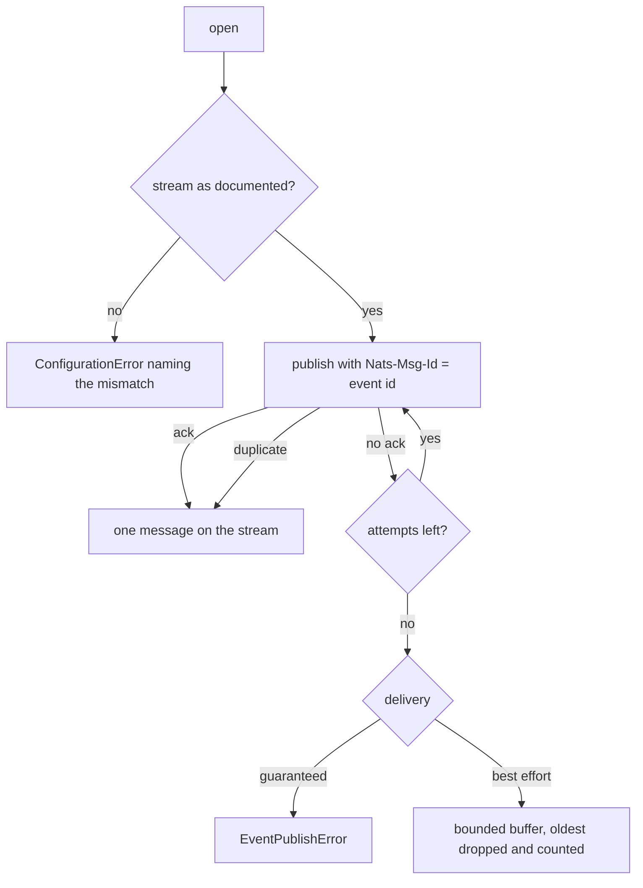

# Events on JetStream

[`docs/events.md`](events.md) defines what an event is. This is the adapter that puts it on
the message bus most deployments already run, and the reason it is one story rather than two:
a publisher that retries without a dedupe header and a consumer that acks before it has
finished each look correct on their own, and together they lose or double every event the
broker ever hiccups on.



## Publishing

```python
from tesserix_adk.adapters import JetStreamEventPublisher, StreamRequirement
from tesserix_adk.core import Delivery, Eventing

publisher = await JetStreamEventPublisher.open(
    jetstream,
    clock=clock,
    requirement=StreamRequirement(name="ADK_EVENTS", min_age_seconds=86_400.0),
    delivery=Delivery.BEST_EFFORT,
)
eventing = Eventing(publisher, clock=clock)
```

The subject is `adk.events.<tenant>.<kind>`. The tenant is a token in the subject so a
consumer can be authorised for its own events and no other — which the stream can enforce
and the payload cannot. `subject_for` refuses anything that is not a plain token, so a
wildcard smuggled in as a tenant name cannot widen who hears the event.

## What is checked before the first event

`open` describes the stream and refuses to start where publishing would not mean what it
appears to mean:

| Refusal | Why it is not a warning |
| --- | --- |
| the stream does not exist, or the broker is unreachable | every publish would report success into a void |
| retention is not `limits` | one consumer's acks would decide what another can still read |
| `max_age` is shorter than `min_age_seconds` | a consumer offline for a weekend silently misses events |
| the subjects do not cover the root | nothing on the stream would store what is published |
| `max_msg_size` is under the payload ceiling | the broker rejects events at some size nobody predicted |

## Retries and duplicates

Every publish carries `Nats-Msg-Id: <event_id>`. When an ack is lost and the publish is
retried, the stream recognises the id and stores one message. The publisher counts what
happened — `published`, `duplicates`, `ambiguous`, `attempted` — so an ack that never
arrived is visible rather than inferred from a downstream count that disagrees.

Under `Delivery.BEST_EFFORT` an unreachable broker fills a bounded buffer; once it is full
the oldest is dropped and `dropped` counts it. `flush()` drains what is buffered when the
broker returns. Under `Delivery.GUARANTEED` nothing is buffered and the caller is told.

## Consuming

```python
from tesserix_adk.adapters import DurableConsumer

consumer = DurableConsumer(
    subscription, handler=record, max_deliver=5, dead_letter=letters
)
while running:
    await consumer.consume()
```

The ack happens after the handler returns. A handler that raises leaves the message for
redelivery; the delivery the consumer's `max_deliver` calls the last one is buried through
the dead letter and terminated, as is anything that is not an envelope. Without a dead
letter it is still terminated — replaying a message nothing can parse helps nobody.

Consumer-side idempotency bookkeeping is a separate concern; the dedupe header makes the
publish exactly-once on the stream, not the handling.

## Stream configuration

The stream is the platform's to provision, not this adapter's to create. What the adapter
needs of it is the table above; expressed as JetStream configuration that is a `limits`
stream over `adk.events.>` with `max_age` at least the documented retention and
`max_msg_size` at least the event ceiling, with durable pull consumers filtered per tenant
subject and an explicit `ack_wait` and `max_deliver`.
