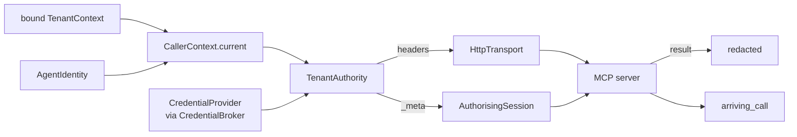

# Who an MCP call is for

An MCP server reached with one long-lived service credential sees the platform rather than
the caller. It cannot scope its answer to a tenant, and an agent acting for one customer
holds whatever the platform holds. Nothing about that is fixed by a header a tool remembers
to set, because the tool that forgets is the one that leaks.

So the authority and the context are assembled per call, from the run: the bound tenant,
the identity resolved when the run started, and the trace this process sits in. A call that
cannot be attributed does not leave the process.



## Wiring one server

```python
from tesserix_adk.adapters import AuthorisingSession, CallerContext, TenantAuthority
from tesserix_adk.adapters import HttpTransport, McpClient, TransportSession
from tesserix_adk.core.config import McpServerConfig
from tesserix_adk.mcp import McpAuthorizer, McpServerAuth
from tesserix_adk.tools.credentials import CredentialBroker

handbook = McpServerConfig(name="handbook", endpoint="https://handbook.internal/mcp")
authorizer = McpAuthorizer(
    CredentialBroker(provider, clock=clock),
    servers={"handbook": McpServerAuth(
        server="handbook", audience="handbook.svc", scopes=("hb:read",)
    )},
)
authority = TenantAuthority(
    authorizer,
    caller=lambda: CallerContext.current(identity=identity, run_id=run_id),
    clock=clock,
)

transport = HttpTransport(handbook, authority=authority)
session = AuthorisingSession(
    TransportSession(transport, config=handbook), authority=authority, server="handbook"
)
client = McpClient(session, config=handbook)
```

Nothing below that names a tenant. `CallerContext.current` reads the one bound by
`tenant_scope`, which the runtime binds for the run, so a tool calling an adopted MCP tool
carries the caller without knowing it did.

## What a request carries

| Where | What | Never |
|---|---|---|
| Headers | `Authorization`, `adk-tenant`, `traceparent`, `tracestate`, the attribution headers | — |
| `_meta` | `tesserix/adk/tenant`, `/subject`, `/run`, `/agent`, `/scopes`, `/traceparent` | the credential |
| Span attributes | `mcp.server`, `mcp.tenant`, `mcp.scopes` | the credential |
| Refusals | the server, the reason, the scopes needed | the credential, the mint's own words |

stdio has no headers, so `_meta` is the channel that works on every transport and carries
the context on both. The credential travels only where there is a header to put it on.

## Failing closed

`TenantAuthority` refuses, before a request is built, when:

- no tenant is bound — the server's own tenant is never the default;
- the bound tenant is not the one the identity was resolved for — a pooled connection or a
  reused authority answering for whoever asks is the leak this prevents;
- the server was never configured — an unconfigured server gets a refusal rather than a
  credential minted for an audience nobody named;
- the run holds nothing the server declares — `AuthorisationError`, because a credential
  for no scopes authorises nothing and arrives downstream as an opaque 403;
- no credential can be minted — `McpAuthError`, never a fallback to an ambient one.

A server asking for more than the caller holds is narrowed, not escalated: what a call
presents is the run's scopes intersected with the server's allowlist. Asking moves that
number down or leaves it alone.

## Credentials that expire

A credential is held under `(tenant, subject, server)` and replaced ahead of expiry rather
than after it. `holding_for` is how long the call may run — `HttpTransport` passes its read
timeout — so a credential that would expire *during* the call is replaced *before* it, and
a call no freshly minted credential can outlive is refused with `McpAuthReason.EXPIRED`
instead of being started on one that will not last.

## Reading a call at the server

```python
from tesserix_adk.adapters import arriving_call

arrived = arriving_call(headers=request.headers, meta=params.get("_meta", {}))
with arrived.bound():
    ...
```

`arriving_call` reads the tenant from the `adk-tenant` header where the transport has
headers and from `_meta` where it does not, and refuses a call that names no tenant or one
that disagrees with what the edge authenticated. A call arriving without a trace is given
one rooted at its run, so it is attributed rather than untraced.

## Redaction

`redacted` masks a server's answer before it reaches a transcript, a span or a memory:
the exact header values the call presented, plus the shapes a credential usually has. A
server that echoes `Authorization` back in its content puts a live token in the one place
everything downstream reads from, and this is the last point before that happens.
`AuthorisingSession` applies it to every result.

## Known limitations

- **Secrets come from the provider, not from here.** `CredentialProvider` is the seam;
  in the cluster it reads GCP Secret Manager through External Secrets. Nothing in this
  module reads a token from configuration, a database or a file.
- **A credential is refreshed between calls, not inside one.** A streamed call is bounded
  by `holding_for`; a token expiring inside a longer stream fails at the server, which is
  a typed refusal rather than a silently continued call.
- **The tenant on the wire is a claim.** A server should authenticate the caller at its
  edge and pass what it proved as `authenticated=`, so a disagreement is refused.
