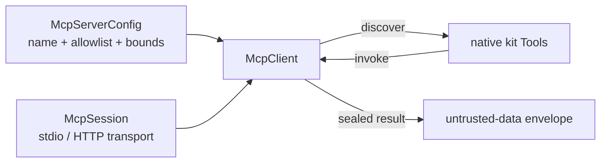

# MCP servers as native tools

`McpClient` adopts one MCP server into the kit's own tool contract. Its tools are
ordinary `Tool` values: arguments are validated in this process before a call leaves it,
the per-tool timeout is the kit's, failures land in the kit's error taxonomy, and every
result comes back inside the untrusted-data envelope. Nothing about an MCP tool is
exempt from what a locally defined tool is held to.



The client speaks to an `McpSession`, which is a protocol: `initialize`, `list_tools`,
`call_tool`, `close`. Transports implement it, tests implement it in process, and
adopting a server therefore says nothing about how that server is reached.

The production `McpStreamableHttpTransport` uses the official SDK's stateless
`server/discover` path for MCP `2026-07-28`; it never performs the legacy initialization
handshake or depends on an MCP session ID. The `McpSession.initialize()` member above is a
transport-neutral compatibility abstraction, not the production HTTP wire sequence.

## Declare a server

Install the optional integration in a source checkout first:

```bash
uv sync --frozen --extra mcp
```

For an application dependency, add `mcp` to the exact tagged artifact selected through
[Keep agents current safely](keeping-current.md).

A server is configuration, resolved through the kit's normal precedence — code over
environment over file over default:

```python
from tesserix_adk.core.config import McpConfig, McpServerConfig

config = McpConfig(
    servers=(
        McpServerConfig(
            name="handbook",
            endpoint="http://handbook.internal/mcp",
            allow=("search", "write_note"),
            timeout_seconds=15.0,
            max_tools=40,
            max_result_bytes=64 * 1024,
        ),
    )
)
```

The same declaration from the environment, where the environment is the layer that owns
it, is JSON under one variable:

```bash
export TESSERIX_ADK_MCP__SERVERS='[{"name": "handbook", "allow": ["search"]}]'
```

`AdkConfig.mcp.server("handbook")` returns the declaration or raises `ConfigurationError`
for a name nobody declared. A name may be declared only once.

## Adopt its tools

```python
from tesserix_adk.adapters import McpClient
from tesserix_adk.tools import ToolRegistry

async with McpClient(session, config=config.server("handbook")) as client:
    discovery = await client.discover(known=registry.names)
    registry = ToolRegistry(discovery.tools)
```

`discover` returns what was adopted, what was rejected and why, which names collided with
a local tool, and whether the discovery cap truncated the list. The tool view is then
held: `tools()` returns the same set for the life of the client, so a server that changes
its mind mid-run cannot widen an in-flight agent's surface. `refresh()` is how that view
changes, and it is always something the consumer chose to do.

An `allow` list, where one is set, is the only tools considered; everything else is a
rejection with its reason. `max_tools` then caps what survives, so a server advertising
hundreds of tools cannot flood a model's context.

## What arrives, and what is refused

Each adopted tool carries the server's own JSON Schema, and arguments are checked against
it locally, so a call that would have failed at the server fails at validation with a
`ToolArgumentValidationError` instead. A root object that says nothing about extra fields
is read as forbidding them, and is advertised that way, so the schema shown to the model
and the schema enforced are the same document.

A schema the kit cannot hold a call to is refused rather than guessed at. That is an
`McpSchemaError` naming the server, the tool and the offending construct — a non-object
root, a non-local `$ref`, nesting past 16 levels, a schema over 32 KiB, or one the
validator cannot compile. The remaining tools still load; the client never registers a
tool it cannot validate arguments for.

## Results and failures

A result is normalised — text as text, an image as `[image image/png, N bytes elided]`, a
resource as `[resource <uri>]`, structured content appended as sorted JSON — truncated at
`max_result_bytes`, and sealed with `Origin.MCP_RESULT` and the source `server/tool`.
Instruction-like text in a server's response is therefore inert for exactly the reason it
is inert from a local tool: it arrives inside an envelope it cannot close.

| What happened | What the caller gets |
|---|---|
| The call outlived `timeout_seconds` | `ToolTimedOutError` |
| The server could not be reached | `ToolFailure(code="mcp_unavailable")`, retryable |
| The server reported a tool error | `ToolFailure(code="mcp_tool_error")`, not retryable |
| The server signalled a decline | `ToolRefusal` carrying the server's refusal code |

The server's own words never enter an error message; a message a model reads outside the
envelope is a message an untrusted server would like to write. MCP tools are treated as
effectful, so nothing retries one on the consumer's behalf, and the run id and the
idempotency key travel as call metadata for a server that wants to deduplicate.

## Known limitations

- A tool's `description` and its schema prose are the server's text and are shown to the
  model as the tool declaration. Adopt servers you would let write a prompt, or wait for
  the allowlist and namespacing story that narrows this further.
- Names are adopted as advertised. A collision with a local tool is reported through
  `discovery.conflicts` and withheld, not renamed — namespacing is a separate story.
- The client carries no authority of its own: auth pass-through and tenant propagation
  are owned by their own story, and only the run id and idempotency key are sent as
  metadata today.

For a network-free executable composition, run
`uv run --extra mcp python examples/mcp_client.py`.
