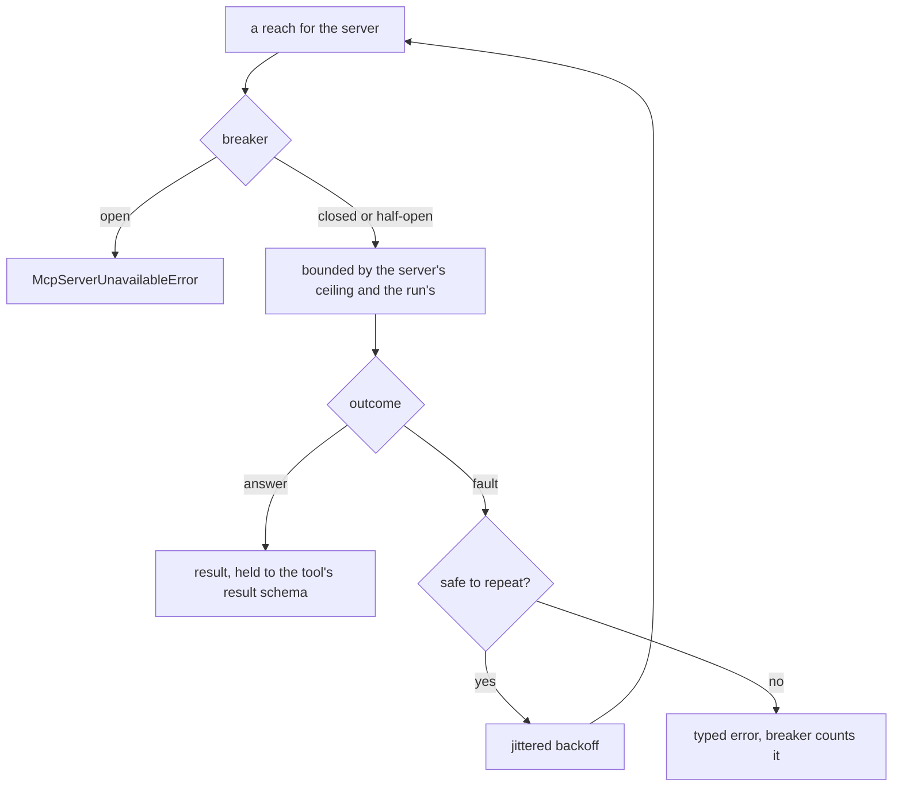

# When an MCP server is slow, unavailable or wrong

An MCP server is a third party in the hot path of a run. The kit's answer is a declared
policy per server rather than a shared hope: every reach for a server is bounded, faults
are retried only where retrying is safe, a server that keeps failing stops being called,
and a server declared optional degrades one capability instead of the whole agent.



## Declaring the policy

```python
from tesserix_adk.core.config import McpServerConfig, RetryConfig

weather = McpServerConfig(
    name="weather",
    endpoint="https://weather.internal/mcp",
    allow=("forecast",),
    required=False,
    connect_timeout_seconds=5,
    discovery_timeout_seconds=5,
    timeout_seconds=10,
    retry=RetryConfig(max_attempts=3),
    breaker_failures=5,
    breaker_reset_seconds=30,
)
```

| Setting | Effect |
|---|---|
| `required` | `True` — the agent is not assembled without it. `False` — its absence is a missing capability, stated to the model as data. |
| `connect_timeout_seconds` | The ceiling on the handshake, so an unreachable server costs a pause rather than a hang. |
| `discovery_timeout_seconds` | The ceiling on reading the tool list. |
| `timeout_seconds` | The ceiling on one call, narrowed further by whatever is left of the run. |
| `retry` | A `RetryConfig`. `max_attempts=1` is no retry at all. |
| `breaker_failures` | Consecutive faults that stop the server being called. |
| `breaker_reset_seconds` | How long before one probe is let through. |

## Applying it

`ResilientSession` wraps any `McpSession`, so nothing above it changes:

```python
from tesserix_adk.adapters import McpClient, ResilientSession, assembled

client = McpClient(
    ResilientSession(session, config=weather, deadline=run_deadline),
    config=weather,
)
fleet = await assembled((handbook_client, client))
```

`assembled` adopts each server in turn. A required server that cannot be reached raises
`McpServerUnavailableError`; an optional one lands in `fleet.degraded` and the run carries
on with the tools that did resolve.

## What is retried, and what is not

| Outcome | Retried |
|---|---|
| `McpTransportError` with a `disconnected`, `timeout` or `unavailable` reason | Yes, where the operation may be repeated |
| A call whose `meta` carries no `idempotency-key` | No — nobody can say whether a second attempt repeats a side effect |
| A refusal, an argument validation failure, a result outside its schema | No — these are answers and decisions, not faults |
| The handshake and the tool list | Yes: reading is repeatable by definition |

Backoff is jittered from the session's own `Random`, so many replicas recovering from one
outage do not arrive together.

## The breaker

`breaker_failures` consecutive faults open it, and while it is open a call raises
`McpServerUnavailableError` — a `CapabilityError` carrying `server` and `state` — without
reaching the server. Nothing is substituted in its place. After `breaker_reset_seconds` the
breaker is half-open and lets one probe through: an answer closes it, another fault shuts it
again. Each session holds its own breaker, so one replica's verdict is not another's.

Call failures count, not only connect failures: a server healthy enough for discovery and
failing every call opens the breaker just the same. A decision the server made — a refusal,
a validation failure — is an answer rather than a fault, and does not count toward it.

## Answers that are not answers

A result is held to the tool's own result schema before it reaches a model. Structured
content that violates it, or a promise of structured content the server did not keep, is an
`McpProtocolError` carrying the raw payload, bounded, for debugging. Nothing partially
parsed is accepted and no plausible result is synthesised.

## Time, and whose it is

Where a `deadline` is given, a call is bounded by whatever is left of the run as well as by
the server's own ceiling. A run with nothing left raises `BudgetExceededError` with
`breached="run_seconds"` before the call is made — the run is out of time, which is not the
server's fault and should not be alerted on as one.

## What on-call sees

`ResilientSession.health` is a `ServerHealth`: the server, the breaker's state, the outcome
class (`ok`, `fault`, `timeout`, `protocol`, `refused`), the operation, consecutive
failures, retries and latency. With an `Instrumentation`, each reach for a server is a span
named `mcp.<server>.<operation>` carrying `adk.mcp.server`, `adk.mcp.operation` and
`adk.mcp.breaker`, redacted on export like every other span.

Signals worth alerting on: `adk.mcp.breaker` leaving `closed`, a rising `fault` or `timeout`
rate for one server, and any `protocol` outcome at all.

## Testing your own degradation

`FaultyMcpServer` is an in-process server that misbehaves on purpose:

```python
from tesserix_adk.testing import FaultyMcpServer, McpFault

server = FaultyMcpServer((forecast,), fault=McpFault.FLAPPING, recover_after=1)
```

`McpFault` is `NONE`, `UNREACHABLE`, `SLOW`, `FLAPPING`, `MALFORMED` or `TRUNCATED`. No
sockets, no subprocess, no network.

## Limits

- The breaker counts consecutive faults, not a failure rate over a window. A server failing
  half its calls stays closed.
- `deadline` bounds a call's wall-clock time. A token or cost ceiling is the run's budget
  and is enforced where the spend is, not here.
- A degraded capability is stated to the model once, when the fleet is assembled. A server
  that fails mid-run degrades that call, not the tool list.

## See also

- [Adopting an MCP server's tools](mcp-client.md)
- [The MCP tool surface](mcp-tool-surface.md)
