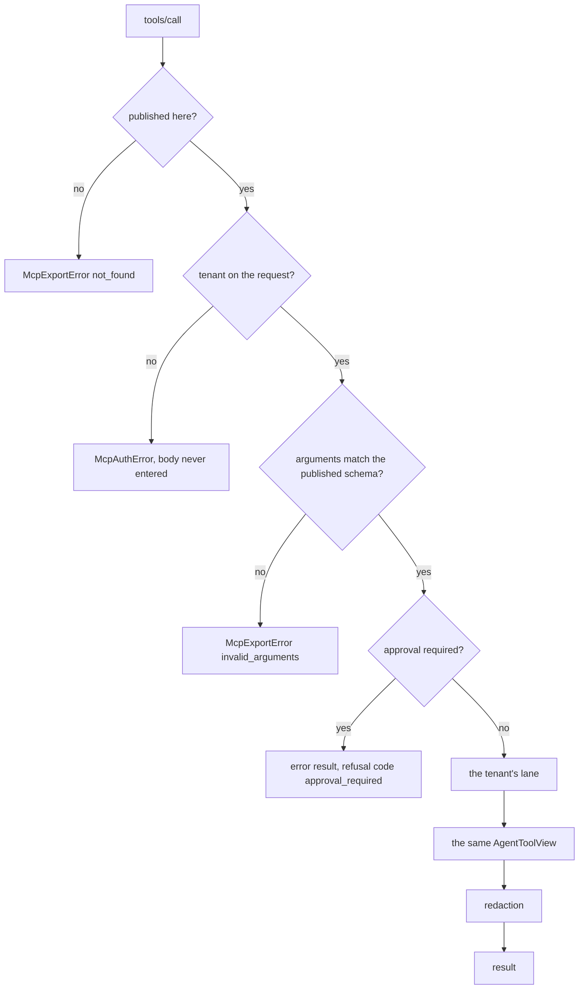

# Publishing kit tools over MCP

A capability written as kit tools is reusable inside one process. The second consumer
usually reimplements it as a standalone MCP server: the schema copied by hand, the
validation rewritten, the tenant check remembered or not. That copy is where a tool ends
up enforcing its tenant check in one deployment and not the other.

`McpServer` publishes the tools that already exist instead. Descriptors are generated from
the `@tool` definitions, calls run through the same registry view an in-process caller
uses, and what is added is only what a remote caller makes necessary: an export allowlist,
a tenant read from the request, per-tenant lanes, and an approval gate that answers rather
than runs.



## Publishing

```python
from tesserix_adk.adapters import McpServer
from tesserix_adk.tools import ToolRegistry

registry = ToolRegistry((fare_for, whose, refund, internal_ledger))
view = registry.view(allow=registry.names, agent="planner")
server = McpServer(view, exports=("fare_for", "whose", "refund"), name="handbook")
session = server.connect()
```

| Argument | Effect |
|---|---|
| `view` | The agent's own tool view. It bounds what may be exported: a server cannot publish authority the agent behind it does not have. |
| `exports` | What is published, normally narrower than the view. A name the view cannot call is an `McpExportError` at construction, not at the first call. |
| `name`, `version` | What the server says about itself when a session is initialised. |
| `per_tenant_calls` | One tenant's share of the process. The registry bounds the process; this bounds a caller. |
| `secrets` | Exact values masked out of every result, beside the shapes always masked. |
| `protocol_versions` | The MCP revisions served. Anything else is refused at `initialize`. |

`ExportedSession` implements the same session protocol the kit's MCP client consumes, so a
published server can be driven in process by the client that would otherwise reach it over
a socket. That is how the two paths are held to one behaviour rather than asserted to have
it — see `TestTheSameToolBothWays` in `tests/test_mcp_server.py`.

## What a remote caller cannot obtain

| Weakening | What happens instead |
|---|---|
| Calling a registered but unexported tool | Refused as not found, in wording identical to a name nobody registered. Its existence is not disclosed. |
| Calling without a tenant | `McpAuthError`. The body is never entered and the server's own tenant is never a default. |
| Claiming a tenant other than the authenticated one | `McpAuthError`, where `connect(authenticated=...)` was given the edge's answer. |
| Arguments outside the published schema | `McpExportError` with reason `invalid_arguments`, scrubbed of whatever was in them. |
| An approval-required tool | An error result whose refusal code is `approval_required`, carrying an `ApprovalRecord` — a digest and a summary, never the arguments. Remoteness is not consent. |
| A longer ceiling than the local path gets | `timeout_seconds` on the request is ignored; the ceiling is the registry's. |
| A result the local path would redact | Redaction runs before serialisation, over both content and structured content. |
| A protocol revision the server does not speak | Refused at `initialize` rather than served best-effort. |

## Errors as results, refusals as codes

A tool's decision is an answer, so it comes back as an error result rather than a protocol
error: `{"refusal": {"code": ...}}` for a `ToolRefusal`, `{"failure": {"code": ...}}` for
anything else, with the code and none of the body's words. The kit's own client maps those
back into `ToolRefusal` and `ToolFailure`, so a caller sees the same taxonomy either way.
A ceiling that elapses arrives as `tool_timed_out`; an exception nobody classified arrives
as `unmapped_failure`.

## Changing what is published

`reload(exports)` replaces the allowlist for sessions opened after it. An open session
keeps the list it was opened with, so a caller's tool list never widens under it, and a
reload naming something the view cannot call leaves the previous allowlist in force.

## Known limitations

- The session is the protocol surface, not a listener. Binding it to stdio or HTTP is the
  consumer's, or the platform's, job — deployment lives in `tesserix-k8s`.
- Approval is answered, never awaited: the pending record has to be routed to an approver
  and the call retried once granted. This server does not hold the call open.
- `secrets` masks exact values a deployment knows about; everything else is masked by
  shape, so a credential in an unusual shape is a shape worth adding to `SENSITIVE_SHAPES`.
- Structured content is published only for tools returning an object or a model. A tool
  returning a string is published without a result schema rather than with one no answer
  could satisfy.
