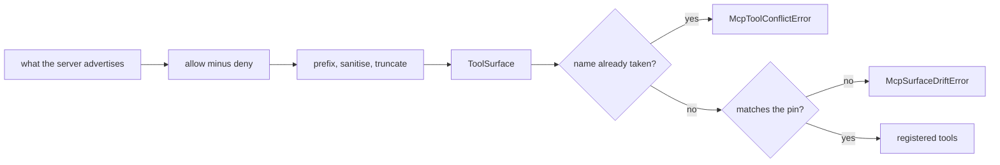

# The MCP tool surface

An agent's tool list is its capability. Assembled from remote servers it is assembled from
someone else's list, so the kit resolves it explicitly: a server contributes the tools its
allowlist names and nothing else, each under a name worked out the same way every time, and
two tools that would answer to one name stop the run rather than shadowing each other.



## Declaring what a server contributes

```python
from tesserix_adk.core.config import McpServerConfig

handbook = McpServerConfig(
    name="handbook",
    endpoint="https://handbook.internal/mcp",
    allow=("search", "tags"),
    prefix="handbook",
)
```

| Setting | Effect |
|---|---|
| `allow=()` | Default-deny. The server contributes nothing; every advertised tool is reported as rejected. |
| `allow=("search",)` | Only `search`. A name here the server does not advertise is a `ConfigurationError`, not a warning. |
| `allow=("*",)` | Whatever is advertised, which is the setting to leave behind once the server is known. |
| `deny=("delete",)` | Never adopted, whatever `allow` says. Naming one tool in both lists is refused at configuration time. |
| `prefix="handbook"` | Model-facing names become `handbook-search`. Empty keeps the server's own names. |
| `max_tools` | How many tools may reach a model at all. |
| `max_schema_bytes` | The ceiling on this server's schemas taken together, which is what a tool list costs a context window. |

A tool that is not adopted is never registered and never described to the model — it is
absent from the tool list, not filtered out of it afterwards.

## Naming

`namespaced(tool, prefix=...)` is the whole rule, and it is part of the contract:

1. Characters outside `[A-Za-z0-9_-]` fold to `_`.
2. A non-empty prefix is joined with `-`.
3. A name over 64 characters keeps its first 55, then `-` and eight hex digits of a digest
   of the whole name, so two long names never become one.

It is deterministic: the same tool under the same prefix always gets the same name, which
is what makes a pin worth taking. A prefix long enough to leave no room for a name is a
`ConfigurationError`.

## Collisions

`ToolSurface.merged(...)` resolves several servers into one surface and raises
`McpToolConflictError` where two tools would answer to one name, naming both origins:

```
wiki/search and docs/search would both answer to search; give one of their servers a prefix
```

Local tools count. `discover(known=registry.names)` treats a remote tool answering to a
local name as the same conflict, reported as `local/search`. Giving one of the servers a
`prefix` is the fix; there is no precedence rule to memorise.

## Pinning

A resolved surface can be written down and committed next to the agent:

```python
discovery = await client.discover()
Path("handbook.pin.json").write_text(discovery.surface.pin().model_dump_json())
```

Given that pin back, discovery holds the server to it:

```python
pin = SurfacePin.model_validate_json(Path("handbook.pin.json").read_text())
client = McpClient(session, config=handbook, pin=pin)
await client.discover()  # McpSurfaceDriftError if anything moved
```

`McpSurfaceDriftError` carries `server`, `tool` and `change`, which is `added`, `removed` or
`changed`. The fingerprint follows the tool's input and output schemas, so a reworded
description is not drift and a new required field is.

## Reading the surface

`ToolSurface.report()` is one line per tool — server, its own name, our name, fingerprint.
An embedding product can pass its resolver to `surface_main` and expose `adk surface`:

```
$ adk surface
wiki  search  wiki-search  83c1c06782e211bc
docs  search  docs-search  83c1c06782e211bc

$ adk surface --server docs --pin
{"entries":[{"server":"docs","tool":"search","name":"docs-search",...}]}
```

`--server` narrows to one server and exits `1` where it contributed nothing.

## Descriptions that give instructions

A tool description sits in the tool list, which is the most privileged place remote text
reaches. One that screens as instructions is kept — the operator allowed the tool — but
inside the untrusted-data envelope, so the model reads it as data rather than as a line in
its own instructions.

## Limits

- The pin covers names and schemas, not behaviour. A server that keeps its schema and
  changes what the tool does is not drift this can see.
- Sanitisation is only reachable through `namespaced` directly: `McpToolDescriptor` already
  refuses a name outside the grammar, so a compliant server cannot advertise one.
- The schema budget is measured on input schemas as advertised, before the kit's own
  `additionalProperties` reading is applied.

## See also

- [Adopting an MCP server's tools](mcp-client.md)
- [Carrying the caller on an MCP call](mcp-auth-context.md)
