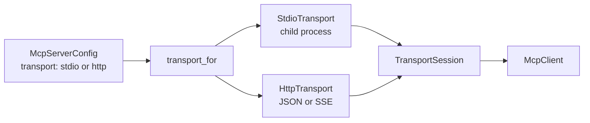

# Reaching an MCP server

An MCP server runs as a subprocess on a developer's machine and as an HTTP endpoint in
the cluster. `McpTransport` is the one seam between the two: everything above it — the
session, the client, the adapted tools, the agent — is written against the protocol, so
moving a server from a laptop to the cluster is a configuration change and never a code
change.



## Declare which one

```python
from tesserix_adk.adapters import TransportSession, transport_for
from tesserix_adk.core.config import McpServerConfig

local = McpServerConfig(
    name="handbook",
    transport="stdio",
    command=("uvx", "handbook-mcp"),
    env_allow=("HOME", "PATH"),
)

cluster = McpServerConfig(
    name="handbook",
    transport="http",
    endpoint="http://handbook.support-platform.svc.cluster.local/mcp",
)

session = TransportSession(transport_for(cluster), config=cluster)
```

A stdio server without an argv and an HTTP server given one are both refused when the
configuration is read, rather than at the first call. The declaration resolves through
the kit's normal precedence, so the same agent image runs against either by environment.

## The ceilings both transports keep

| Setting | What it bounds |
|---|---|
| `max_message_bytes` | One message, on the wire or on a pipe. Past it, `LIMIT`. |
| `read_timeout_seconds` | How long a read may stall before the call fails. |
| `max_in_flight` | Requests outstanding on one connection at once. |
| `timeout_seconds` | One operation end to end. |

A limit only one transport enforces is a limit nobody can rely on, so both keep all four.

## The child process

The child is spawned from an explicit argv — never a shell string — and inherits only the
variables in `env_allow`. A subprocess that inherits this process's environment inherits
its credentials, and an MCP server is exactly the thing that should not have them.

Its stderr is drained continuously so a full pipe cannot wedge it, and the last lines are
kept on `stderr_tail` for the failure that needs them. On close, on cancellation and on
failure the child is terminated, given five seconds, and then killed; `returncode` is set
by the time `close()` returns, so no orphan survives the run.

## The endpoint

Redirects are never followed and anything that is not `application/json` or
`text/event-stream` is a transport failure: an intercepting proxy answering with an HTML
error page is precisely where parsing whatever arrived is the wrong thing to do. A 5xx is
`UNAVAILABLE`, a 4xx is `PROTOCOL`. Unreachable endpoints are tried three times with
jittered backoff, so many replicas do not amplify one outage, and then reported as one
failure rather than retried without end.

## Failures

`McpTransportError` carries a reason, because a connection that dropped and a read that
never came call for different handling:

| Reason | What happened |
|---|---|
| `DISCONNECTED` | The child exited or the stream closed mid-call. |
| `TIMEOUT` | The read deadline fired on a stream that went quiet without closing. |
| `PROTOCOL` | The answer was not protocol, or was a JSON-RPC error. |
| `LIMIT` | A message ran past `max_message_bytes`. |
| `UNAVAILABLE` | The endpoint could not be reached, or the process would not start. |

`.retryable` is true for `UNAVAILABLE` and `TIMEOUT` only. Nothing here retries above the
transport's own bounded attempts; that policy is its own story.

The server's own error text never travels into the message. A run fails closed rather
than receiving a partial or an invented response.

## Testing without a server

`RecordingTransport` answers from a script and records what it was asked, so tool
behaviour is tested with no subprocess and no socket:

```python
from tesserix_adk.adapters import McpClient, RecordingTransport, TransportSession

transport = RecordingTransport({"tools/list": {"tools": [...]}})
client = McpClient(TransportSession(transport, config=config), config=config)
```

A method nobody scripted is a `PROTOCOL` failure, so a test cannot pass by accident on a
call it never arranged.

## Known limitations

- `McpTransport` is public and changes only under the kit's deprecation policy, so a
  transport written outside the kit survives minor versions.
- No authority is attached here: headers are passed through, and minting a credential
  belongs to the auth story.
- The SSE reader takes the first data event of a reply. Server-initiated streams of
  notifications are not read yet.

For a network-free executable composition, run
`uv run python examples/mcp_transports.py`.
