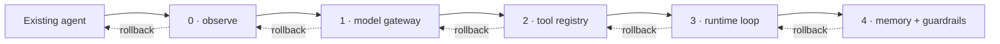

# Migrate an existing agent without a rewrite

Adoption is a sequence of reversible boundaries, not a flag day. Keep the existing path
deployable, move one responsibility, compare both paths against the same evidence, and
stop at any useful halfway state. The Tesserix Agent Development Kit does not need to own
orchestration before it can add value.

Run the offline first-stage example from a source checkout:

```bash
uv run python examples/migrate_legacy_provider.py
```

It keeps the legacy client and tools intact while adding the provider contract, tenant
attribution and a model-call ceiling. CI runs this exact command.

The migration sequence is:



## Establish the comparison before changing code

Record a representative, versioned dataset and agree thresholds before seeing the new
results. A convenient number chosen afterward is not a gate.

| Evidence | Compare on both paths |
|---|---|
| Quality | Same cases, expected facts, citations, deterministic graders and reviewed model judge where necessary |
| Cost per run | Provider-reported tokens and priced cost at p50/p95, by tenant and agent revision |
| Latency | End-to-end p50/p95 including retries, tool waits and failures |
| Reliability | Completion, typed refusal, cancellation, timeout, malformed output and duplicate-effect rates |
| Safety | Injection, another-tenant access, approval, erasure and secret-redaction cases |
| Operations | Recovery time, checkpoint age, queue depth and rollback time |

Use the same provider deployment, model version, prompt, tool data and concurrency when
comparing runtime overhead. If that cannot be held constant, label the result
incomparable rather than attributing the difference to the kit.

## Pattern map

| Existing pattern | Tesserix boundary | First stage |
|---|---|---|
| Logs around a vendor loop | OpenTelemetry spans, run identity and redaction | Stage 0 |
| Vendor client and exceptions | `ModelProvider`, capability declaration and typed errors | Stage 1 |
| Raw functions exposed to a model | `@tool`, generic interop importer and `ToolRegistry` views | Stage 2 |
| Hand-written model/tool loop | `AgentRunner`, typed `Run` outcomes and checkpoints | Stage 3 |
| Prompt-only safety and application memory | Ordered `GuardrailPipeline`, tenant-scoped memory and erasure | Stage 4 |
| Another framework stays in charge | Tool/agent adapters, MCP and official A2A | Supported halfway state |

## Stage 0 — Observe the existing agent

Add run, tenant, user, agent revision and provider identifiers to the existing path. Start
one trace at request ingress and propagate W3C trace context through existing model, tool
and queue calls. Export only redacted attributes; retain the existing control loop,
provider and tools.

Instrumentation must not become authorization. Tenant still comes from the authenticated
application context, not a model argument or editable telemetry header. Trace and metrics
export failure is bounded and fail-open; identity, policy and audit persistence retain
their existing failure behavior.

**Immediate value:** The baseline becomes attributable and measurable before behavior
changes. Cost, latency and failures can be compared per run and revision.

**Verify:** Replay the evaluation set and confirm answers, tool effects and provider calls
are unchanged. Inject an exporter outage and prove the request still follows the existing
path without leaking a prompt, credential or personal datum.

**Rollback:** Disable the instrumentation registration. No provider, tool, state or data
contract moved.

**Escape hatch:** Keep the existing tracer/exporter through the next stages if it already
meets the telemetry convention. Preserve the same run, tenant and trace identifiers at
the adapter boundary.

## Stage 1 — Add the model gateway

Implement the small `ModelProvider` protocol around the existing client. Translate the
request, response, usage, stream and vendor exceptions at this one boundary. Declare
capabilities and context limits for the exact deployed model. Keep the legacy orchestrator
and all tools unchanged.

The runnable [legacy provider
example](https://github.com/tesserix/agent-development-kit/blob/main/examples/migrate_legacy_provider.py)
is the before/after fragment: `LegacyClient` remains application code and
`LegacyProvider` is the only new adapter.

**Immediate value:** Every model call has one provider-neutral shape, capability check,
usage record, deadline and typed failure vocabulary. Groq, xAI/Grok, OpenRouter, local
models and custom gateways can be swapped without changing agent logic.

**Verify:** Run the same quality set through the old client and adapter. Compare tokens,
cost per run and p95 latency. Inject authentication failure, rate limiting, timeout,
malformed JSON and an unsupported capability; no paid request should occur for work the
capability declaration already refused.

**Rollback:** Route the legacy orchestrator back to its original client. No tool or state
contract changed and the adapter can remain tested but unused.

**Escape hatch:** Keep the existing retry, cache or gateway around the client temporarily.
It must propagate the caller deadline and return provider usage; do not retry non-retryable
errors or effectful work at multiple layers.

## Stage 2 — Adopt the tool registry

Move one existing function at a time behind `@tool`, or translate a foreign framework tool
through `import_tool`/`import_toolset`. Declare typed arguments, output, allowlist, scopes,
timeout, approval and idempotency. The existing orchestrator can invoke a fixed
`ToolRegistry.view` while it still owns the loop.

For irreversible work, the model proposes an action. Deterministic application code
authorizes and executes only after approval bound to the exact canonical argument hash.
An unknown post-timeout effect is indeterminate; retry only with a downstream idempotency
key.

**Immediate value:** Invalid schemas, unauthorized tools, concurrency excess and
unapproved actions stop before the legacy function executes. Provenance and tenant context
are consistent across native, MCP, Google and other imported tools.

**Verify:** Compare tool-selection evaluations and successful/rejected arguments. Invoke
the same effect concurrently and after a simulated timeout or worker crash; the downstream
mutation occurs at most once within the idempotency retention window. Verify another
tenant cannot observe or approve the action.

**Rollback:** Remove the migrated tool from the Tesserix allowlist and route that intent to
the prior application handler. Keep idempotency and approval records for their full retry
window so rollback cannot create a duplicate effect.

**Escape hatch:** Keep a legacy tool body and dependencies unchanged behind an explicit
adapter. The adapter must accept `ToolContext`, preserve tenant/user/trace/deadline, declare
repeat behavior and return a typed outcome; direct model access to the raw function is not
a supported escape hatch.

## Stage 3 — Adopt the runtime loop

Move the model/tool control loop to `AgentRunner` after provider and tool contracts are
stable. Define the output model, instructions, provider/model selector, tool names,
budgets and guardrail names in `Agent` or `AgentDefinition`. Where the application already
has a Pydantic request, use `TypedAgent` or `TypedAgentDefinition` and the separately named
`run_typed` surface. Persist checkpoints and
idempotency state outside the worker before depending on crash recovery or scaling beyond
one process.

Keep the old endpoint and deployment live during canary. Route a deterministic slice of
traffic or shadow requests that are guaranteed read-only. Never shadow an effectful tool
unless the shadow path is hard-disabled from mutation.

**Immediate value:** One lifecycle now owns budgets, retries, cancellation, tool outcomes,
structured output and terminal `Run` states. The application receives completed, refused,
cancelled or failed—not an invented partial success.

**Verify:** Compare full evaluation quality, cost per run, p95 latency and terminal-state
rates. Kill the worker before/after each effect boundary, cancel during model and tool
calls, exhaust budgets and provider retries, and resume versioned checkpoints.

**Rollback:** Stop assigning new runs to the Tesserix worker, drain or version-pin existing
runs, and route new requests to the legacy loop. Do not delete checkpoints, journals or
idempotency rows to make rollback look clean.

**Escape hatch:** Keep orchestration outside indefinitely and call an exported Tesserix
agent as a typed tool, MCP capability or official A2A peer. Preserve authenticated
principal, tenant, deadline, shared budget and trace at ingress; A2A task delegation must
not be flattened into an untrusted tool payload.

## Stage 4 — Add memory and guardrails

Move safety and personal data last because they require product-specific policy and data
ownership. Declare ordered input/output guardrails once. Migrate one memory class or
retrieval collection at a time under tenant and subject scope, retaining provenance and
version metadata. Treat every retrieved value as untrusted data.

Dual-read only for a bounded comparison window; do not dual-write indefinitely. Personal
data erasure covers source rows, derived chunks, embeddings, graph facts, indexes, caches,
checkpoints and queued writes. A partial erasure is a typed failure, not success with a
warning.

**Immediate value:** Every execution path—including tools, handoffs and foreign
agents—receives one ordered safety boundary. Memory gains tenant isolation, bounded
retrieval, provenance, retention and auditable erasure.

**Verify:** Run safety and retrieval evaluations, seeded PII/injection cases and
another-tenant reads. Compare rejection rate, false positives, groundedness, cost per run
and p95 latency. Exercise erasure before and after re-indexing and prove no derived copy
remains reachable.

**Rollback:** Re-enable the existing guard path and switch reads to the source store while
leaving the copied collection read-only. Finish or compensate in-flight erasures before
deleting either copy; retain the mapping needed to prove both sides were erased.

**Escape hatch:** An existing guard or memory service can remain behind the protocol when
it preserves tenant/user scope, deadlines, typed unavailable behavior, provenance,
retention and erasure. A prompt instruction to “be safe” and an unscoped vector client are
not adapters.

## Supported halfway states

Orchestration can stay outside the kit indefinitely. Useful stable stopping points are:

- provider adapters plus existing orchestration;
- Tesserix tool registry under another framework's loop;
- Tesserix runtime with the application's existing memory;
- an existing framework calling a Tesserix agent through MCP or official A2A;
- a Tesserix supervisor wrapping a Google Agent Development Kit `BaseAgent` through an
  explicit application-owned invoker.

Every halfway state preserves tenant/user context, scopes, deadline, cancellation, shared
budget, trace and typed outcomes. Use [framework interoperability](framework-interop.md)
to choose the narrowest adapter. See [integrations](integrations.md), [Google Agent
Development Kit interoperability](google-adk.md), [MCP](mcp-client.md), [official
A2A](a2a.md), and the [end-to-end lifecycle](agent-lifecycle.md).

## Decision checklist

Move to the next stage only when all answers are yes:

- Does the current stage have a passing versioned evaluation and safety dataset?
- Are cost per run and p95 latency inside thresholds agreed before the comparison?
- Is the rollback route tested, one action and independent of deleting state?
- Are tenant, user, scopes, deadline, cancellation, trace and budget preserved?
- Are unsupported schemas/capabilities and unavailable policy dependencies fail-closed?
- Is every effect classified and protected by approval/idempotency where required?
- Is the new public contract pinned to an owner, stability level and compatibility range?
- Can operators identify and recover a run without reading secrets or raw prompts?

If no, keep the current halfway state and open a gap with evidence.

## Do not migrate these mistakes

- Do not hide business rules, authorization or approval in prompt strings.
- Do not parse free text to decide money movement or another irreversible action.
- Do not retry an unknown effect without an idempotency key.
- Do not accept tenant, user, role or scope from model/tool payloads.
- Do not copy memory without ownership, provenance, retention and erasure.
- Do not put credentials in prompts, Agent Cards, registry metadata, MCP arguments or
  `ForeignAgentContext`.
- Do not create a local workaround that bypasses budgets, guardrails, identity,
  idempotency or typed outcomes.

## Compatibility, deprecation and genuine gaps

Before 1.0, alpha subpackages may change in a minor release. Pin the exact reviewed release
for each comparison, consult the [stability matrix](stability.md), and run the documented
[deprecation checks](deprecations.md) before moving a stage. Stable and beta contracts have
their declared compatibility windows; “the package is 0.x” is not one blanket promise.

For typed application input, do not rewrite `Agent[OutputT]` annotations. Migrate one call
site at a time to `TypedAgent[InputT, OutputT]` and `run_typed`; rollback is the original
text serialization plus `runner.run`. The two paths use one execution engine, so this
changes the application boundary without changing provider, tool, policy, identity,
budget, trace, or terminal-run semantics. A future unification remains tracked in #161
and requires a deprecation window; it is not a release-check exception.

An escape hatch is compatible only when it crosses a public protocol and preserves the
runtime context above. Internal module imports, monkey-patches and copied private adapters
receive no compatibility promise. Remove an escape hatch after the native boundary has
passed the same evaluations and observation window.

If a stage exposes a genuine missing capability, stop and open a [GitHub issue](https://github.com/tesserix/agent-development-kit/issues)
with the contract, failure
case, security boundary, current workaround and baseline evidence. Link the consuming-team
backlog. The architectural decision and its consequences are recorded in [ADR
0004](adr/0004-incremental-adoption.md); public typed-input compatibility is recorded in
[ADR 0005](adr/0005-additive-typed-input.md).
