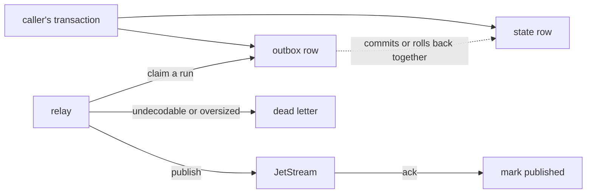

# The transactional outbox

Writing a run result and publishing its event are two operations against two systems. Either
can succeed alone. The two failures look like this:

* the state committed and the publish failed — a completed run nothing downstream hears about;
* the publish succeeded and the transaction rolled back — a completion that never happened,
  acted on by every consumer that was listening.

Neither raises anything at the time. They surface weeks later as a count nobody can explain.

The outbox removes the second operation. The event is inserted into a table in the same
database, inside the caller's transaction, so it commits with the state or disappears with it.
A relay moves committed rows onto the real transport afterwards.



## Using it

```python
from tesserix_adk.adapters import OutboxRelay, PostgresOutbox, PostgresOutboxSettings

outbox = await PostgresOutbox.open(session, clock=clock, settings=PostgresOutboxSettings(dsn=dsn))

async with transactor.transaction() as tx:
    await states.bound(tx).put_run(record)
    await outbox.bound(tx).publish(event)
```

The relay is a separate process, or a task in the same one:

```python
relay = OutboxRelay(transactor, jetstream, clock=clock, worker=hostname, dead_letter=letters)

while running:
    if await relay.deliver() == 0:
        await clock.sleep(poll_seconds)
```

`Eventing` takes the outbox anywhere an `EventPublisher` goes, so nothing above the adapter
layer knows which one it is.

## What is guaranteed

**Atomicity.** The event is exactly as reliable as the transaction that caused it. A rollback
publishes nothing, because there is nothing to publish.

**At-least-once, not at-most-once.** The relay publishes *before* it marks the row, inside the
claiming transaction. A crash in between republishes on the next poll. That duplicate is
suppressed by publish-side dedupe on the event id — `JetStreamEventPublisher` sets
`Nats-Msg-Id`, and the stream collapses the second copy within its dedupe window. Marking
first would lose the event instead, which is the trade nobody wants.

**Order per run.** Rows are claimed a whole run at a time under
`pg_try_advisory_xact_lock(hashtext(run_id))`, held for the claiming transaction. Two relay
replicas therefore never hold events of the same run at once, and its events cannot overtake
each other.

## What is not

**There is no global order.** Events of different runs may reach the transport in any order,
and no amount of locking fixes that without serialising every relay in the fleet. Consumers
that need a total order need a sequence number they define themselves.

**The transport call happens while the advisory lock is held.** That is the cost of claiming
and marking in one transaction. A slow transport holds a lock on one run, not on the table —
but keep the relay's `batch` small enough that a publish timeout cannot outlive the
connection's `statement_timeout`.

**There is no Redis outbox.** The pattern needs a store that can commit the state change and
the row together. Redis cannot, and an outbox that is not in the same transaction is just two
operations with more moving parts. Use PostgreSQL, or accept at-most-once.

**The relay does not create the table.** `EXPECTED_OUTBOX_SCHEMA` is the DDL the adapter was
written against; the platform's migration repository owns applying it. `open()` reads the
recorded version and refuses a database that is a different shape, at startup rather than at
the first write.

## Failure handling

A transport that is down for ten minutes loses nothing: `deliver` raises, the transaction
rolls back, no row is marked, and the rows accumulate. Delivery resumes in per-run order on
recovery. `relay.failed` counts the polls that raised.

Two rows can never be delivered and would otherwise sit at the head of their run for ever:

| Reason | What it is |
|---|---|
| `undecodable` | The payload is not an `EventEnvelope` — a hand-written row, or a schema that moved under it. |
| `too_large` | Bigger than the transport will carry. Retrying it is a loop, not a recovery. |

Both go to the `dead_letter` if one is configured, are counted in `relay.buried`, and are
marked published so they stop blocking the run behind them.

## Operating it

`lag()` returns the two numbers worth alerting on:

| Metric | Alert when |
|---|---|
| `unpublished` | Above the batch size for more than a few poll intervals — the relay is behind or dead. |
| `oldest_seconds` | Above 60s. A row older than that means delivery has stopped, not slowed. |

A sustained outage grows the table until the disk fills, so page on `oldest_seconds` rather
than waiting for `unpublished` to look alarming.

`prune()` removes published rows older than `retention_seconds` (a week by default) and never
touches an unpublished one. Run it on a schedule; the partial index on `published_at` keeps it
off the relay's own read path.

## Redaction

The envelope is scrubbed where it is built — see [events](events.md) — so the outbox stores
what the transport would have carried and nothing more. Nothing redacts at insert time,
because a row that was written unredacted has already been persisted.
