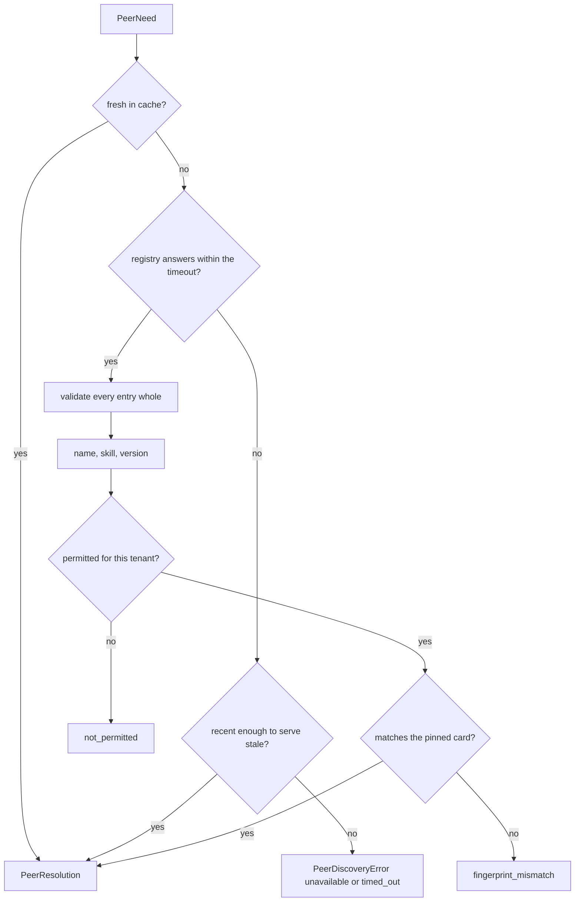

# Finding a peer

Peer endpoints live in per-environment configuration, so moving an agent is a coordinated
change across every caller, and "which agent can price a leg" is a question nobody can ask.
A registry answers it — and a registry is also something that can be wrong, be compromised,
or be down. None of those may become a call to the wrong host.

Resolution is therefore a sequence of refusals, and every failure is closed: the kit does
not guess an endpoint, does not use a card that failed validation, and does not invent a
peer that could satisfy a skill.



## Resolving

```python
from tesserix_adk.a2a import PeerNeed, RegistryPeers

peers = RegistryPeers(fetch, permitted={"acme": ("booker",)}, pinned={"booker": digest})
found = await peers.find(PeerNeed(skill="price_leg", version=">=2.0.0", tenant="acme"))
```

`StaticPeers(cards)` is the same thing from configuration, with the same matching and
selection rules, for a deployment with no registry and for tests. `PeerDiscovery` is the
protocol both satisfy, so nothing downstream is welded to either.

| Argument | Effect |
|---|---|
| `fetch` | How the org's registry is actually reached. The kit does not own that transport. |
| `ttl_seconds` | How long a resolved peer is reused. |
| `negative_ttl_seconds` | How long "nobody does this" is remembered, so a missing skill is not asked about on every call. |
| `stale_seconds` | How far past the TTL an answer may still be served while the registry is unreachable. |
| `timeout_seconds` | Discovery's own ceiling, so resolution cannot spend the run's deadline. |
| `permitted` | Which peers each tenant may be given, keyed by tenant with `""` as the default. `None` permits anything listed — a deliberate choice for a closed network, not a default to reach by omission. |
| `pinned` | Expected card fingerprints by agent name. |

## Version constraints

| Written | Matches |
|---|---|
| `""` | any version |
| `"2"` | any `2.x.y` |
| `"2.1"` | any `2.1.y` |
| `"2.1.0"` | exactly that version |
| `">=2.1.0"` | that version or newer |

Where several peers satisfy a need, the newest compatible one wins and ties are broken by
agent name. The choice is therefore the same on every run and on every replica, and
`PeerResolution.attributes()` records which peer, which version, which source and whether
it was stale, so a call can be attributed to the decision that produced it.

## Not trusting the registry

| Attempt | What happens |
|---|---|
| An entry that is not a valid card | Rejected whole, never partially used, and recorded in `rejections` |
| An entry naming a peer the tenant may not use | Not returned. The refusal says nothing matched that this tenant may be given, never which peer was withheld |
| An entry moved to another host | `fingerprint_mismatch`, where the peer is pinned |
| A registry that is down, with nothing cached | `unavailable`. No endpoint is guessed |
| A registry that hangs | `timed_out` at discovery's own ceiling, not the run's |
| Descriptions or metadata on an entry | Data. Never concatenated into an instruction — see [agent-cards.md](agent-cards.md) |

## When a peer goes away

A cached peer that has since been withdrawn is discovered by calling it, not by resolving
it. When that call fails, `invalidate(need)` drops the entry so the next resolution asks
the registry again rather than retrying the same dead host.

## Known limitations

- The registry's API and its server are not the kit's: `RegistryFetch` is where a
  deployment plugs in whichever registry it runs.
- Stale-while-revalidate serves the stale answer; it does not refresh in the background.
  The next call after the registry recovers is the one that refreshes.
- Rejections are the last 32, in memory, per client. They are for explaining a refusal in
  the moment, not an audit trail.
- Constraint syntax is the five forms above, not a general range grammar. A wider grammar
  is a dependency and a parser, for constraints nobody has asked for yet.
