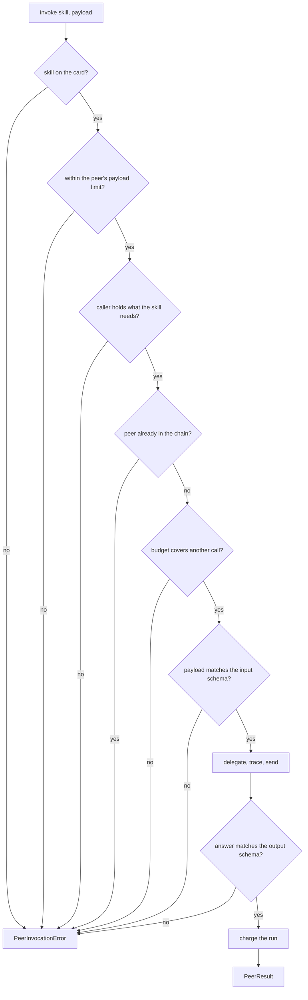

# Calling a peer

Delegation between agents is usually an HTTP call carrying a prompt and a service token.
Four things follow from that shape: the caller parses free text back out of the answer, the
peer sees the platform rather than the person, a failure spanning both agents is two
unrelated traces, and whatever the peer spent is invisible to the caller's ceiling.

`PeerClient` makes it a call instead. Both directions are held to the schemas the peer
published, the delegation carries the original principal with the caller's scope narrowed,
the hop is a child span of the run, and what the peer reports lands on the run's budget.



## Invoking

```python
from tesserix_adk.a2a import PeerClient

client = PeerClient(
    card, transport, credentials=broker, identity=identity, run_id=run_id, clock=clock,
    budget=budget, trace=span, timeout_seconds=30.0,
)
result = await client.invoke("price_leg", {"leg": "LHR-JFK"}, idempotency_key=key)
```

`PeerResult` carries the peer, the skill, the validated `output`, the `usage` charged, the
delegation `chain` and whether the reported figures were believed. `attributes()` is what a
span records — the peer, the skill, the call and the chain, never the answer.

| Argument | Effect |
|---|---|
| `transport` | How the call actually travels. The kit owns none of that. |
| `credentials` | Where a token minted for the peer's audience alone comes from. |
| `identity` | Who the run acts for, and what it holds. The ceiling on delegated scope. |
| `budget` | The run's ceiling. A call the remainder cannot cover is refused before it is made. |
| `trace` | Where the caller sits, so the peer joins the trace rather than starting a second one. |
| `chain` | What the work already passed through. A peer already in it is a cycle. |
| `timeout_seconds` | The ceiling on one call. A `deadline_seconds` may narrow it, never widen it. |
| `max_reported_tokens` | The most a peer may claim one call consumed before the figure stops being believed. |

## Streaming

```python
async for event in await client.stream("price_leg", payload, cancellation=token):
    ...  # PeerProgress while it works, one PeerResult at the end
```

A transport that does not implement `stream` raises `CapabilityError` rather than silently
falling back to a single call that answers much later than the caller expected.

## Offering a peer skill to a model

```python
from tesserix_adk.adapters import peer_tool

quote = peer_tool(client, "price_leg")     # named booker-price_leg
registry.register(quote)
```

The card is the only source of the tool's contract: the model is shown the peer's own input
and output schemas, an `idempotent` skill is marked idempotent and parallel-safe, a skill
the peer gates on a human is gated here too, and the client's timeout is the tool's timeout.
A description that screens as an instruction is fenced as untrusted data before it reaches
the tool list. Arguments are refused with `ToolArgumentValidationError` naming the field and
never its value, before the peer is called at all.

## Refusals

Every failure is a `PeerInvocationError` carrying the peer, the skill and a `reason`.

| Reason | When |
|---|---|
| `unknown_skill` | The card does not publish it |
| `input_schema` | The payload is not what the peer said it takes. Nothing is sent |
| `output_schema` | The answer is not what the peer said it returns. Nothing is parsed out of it |
| `schema_unsupported` | The published schema uses a keyword the kit does not check |
| `scope_escalation` | The skill needs more than the run holds. Never widened to fit |
| `too_large` | Beyond the payload size the card declares |
| `unavailable` | The peer published itself as degraded |
| `transport` | The call did not reach the peer |
| `timed_out` | No answer inside the deadline. The peer is told to stop |
| `cancelled` | The run stopped waiting. The peer is told to stop and a late answer is dropped |
| `budget` | The remaining ceiling could not cover the call |

## What cannot happen

| Attempt | What happens |
|---|---|
| A peer asking for more scope than the caller holds | Refused. Delegation attenuates only |
| A calling B calling A | `DelegationLimitError` with the path, before the call is made |
| A peer reporting a million-token call | Bounded at `max_reported_tokens` and flagged `usage_trusted=False`, with the run's own ceiling still enforced |
| A peer reporting no usage at all | Counted as an invocation anyway, so the invocation ceiling still bites |
| A retried delegation | The same idempotency key travels, so the peer's effect happens once |
| A credential in a log line | `PeerCall.headers` is not rendered, and `details` never carries the payload |
| Personal data in an answer reaching telemetry | `PeerResult.redacted()` is what goes to a span or a memory |

## Schemas the kit checks

The kit validates against the subset an agent card carries: `type`, `properties`,
`required`, `additionalProperties`, `items`, `enum`, `const`, `anyOf`, local `$ref`, and the
length, size and range bounds. Anything else raises `UnsupportedSchemaError` and the call is
refused — a keyword that is skipped is a constraint the caller believes it checked.
`checkable(schema)` walks a schema whole, so `peer_tool` finds an unsupported keyword while
the tool is built rather than on the first call that carries that field.

## Known limitations

- The transport is not the kit's. HTTP, gRPC or a queue is the deployment's choice, and the
  `PeerTransport` protocol is the whole contract.
- The schema subset is deliberately not all of JSON Schema. `jsonschema` is an `mcp` extra,
  and a peer call is not a reason to make it a core dependency.
- Progress events are whatever the peer sends. The kit does not synthesise them, and a
  transport with no streaming has none.
- Usage arrives from the peer. Bounding and flagging is the defence; there is no way to
  audit another agent's token count from here.
