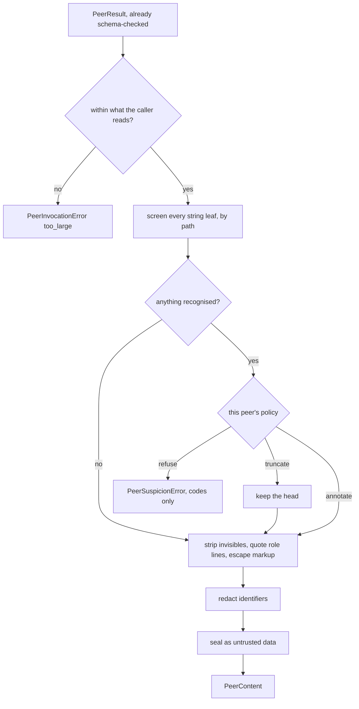

# Reading a peer's answer

A peer is chosen by the operator, so its answer arrives feeling like the operator's. It is
not. The peer read a web page, or a document a customer uploaded, and whatever was in there
is now inside a field the caller is about to paste into a prompt. Worse than a tool result:
a peer can be persuaded, so it can be made to ask on someone else's behalf.

`PeerBoundary` is the one place an answer becomes something the caller may read.



## Containing

```python
from tesserix_adk.a2a import PeerBoundary, PeerTrustPolicy, TrustDecision

boundary = PeerBoundary(
    policy=PeerTrustPolicy(per_peer={"booker": TrustDecision.TRUNCATE}),
    instructions=agent.instructions,
)
content = boundary.contain(result, tenant="acme", card=fingerprint(card))
prompt = f"The desk asked booker to price the leg:\n{content.text}"
```

`PeerContent.text` is a sealed block whose delimiter carries a digest of the content, so an
answer that writes the closing tag closes nothing. `attributes()` is what a span records —
the peer, the skill, the card, the decision, the codes and the field paths, never a
character of the answer itself.

| Field | What it says |
|---|---|
| `codes` | What screening recognised: `override`, `impersonation`, `tool_shaped`, `fence`, `encoded`, `system_echo` |
| `fields` | Where, by path — `legs[0].note`. The path is recordable; the text at it is not |
| `decision` | What the policy did about it |
| `truncated` | Whether part of the answer was dropped |
| `redactions` | Which kinds of identifier were replaced before delivery |

## What the policy decides

| `on_suspicion` | Effect |
|---|---|
| `annotate` | Deliver it, sealed and flagged. The default: a false positive must not lose the answer |
| `truncate` | Deliver the head, on the reading that a payload is usually appended |
| `refuse` | Fail the call with `PeerSuspicionError`, carrying the codes and never the text |

`per_peer` overrides it for one agent. One flaky peer is not a reason to fail closed on all
of them, and the reverse — one peer that reaches somewhere expensive — is more often the case.

## What an answer cannot do

An answer is evidence. Approval, spend and further delegation are decisions.

```python
boundary.permitted(content, ProposedAction(tool="refund", approval_required=True))
# PeerActionError: refund is gated on approval and the only thing asking for it is
# booker's answer

boundary.permitted(
    content,
    ProposedAction(tool="refund", approval_required=True),
    decided_by="policy:refunds-under-50",
)
```

`decided_by` is the point: a policy, a rule or a human that the caller can name afterwards.
"The model thought so" has no name.

`content.source()` plugs into the same `Containment.hold` every other boundary uses, so an
answer that argues for a wider allowlist, a different principal or another tenant is refused
structurally rather than by the model choosing not to be persuaded.

## The corpus

`PEER_CORPUS` is the shipped conformance set: forged turns, instructions delegated onward,
a peer asking to widen its own scope, instruction nested in a structured field, a payload
hidden as base64, zero-width characters and homoglyphs — with a control set of ordinary
answers that must pass unflagged. Both halves run in the kit's own tests, offline.

```python
from tesserix_adk.testing import PEER_CORPUS

for case in PEER_CORPUS:
    contained = boundary.contain(answer(case.output), tenant="acme")
    assert bool(contained.codes) is case.hostile
```

## Known limitations

- Screening is heuristic. It is evidence for the policy, not the defence — the seal is,
  and it holds whether or not the heuristics recognised anything.
- Field *names* are the output schema's business. A card that declares
  `additionalProperties: false` is what keeps an instruction out of a key.
- Homoglyphs are flagged and left standing. Folding them is right for matching and wrong
  for delivery: a Cyrillic word in a real answer is a word.
- Truncation cuts a rendered JSON document, so a truncated answer is prose rather than
  parseable. That is the point at which the caller should be refusing instead.
