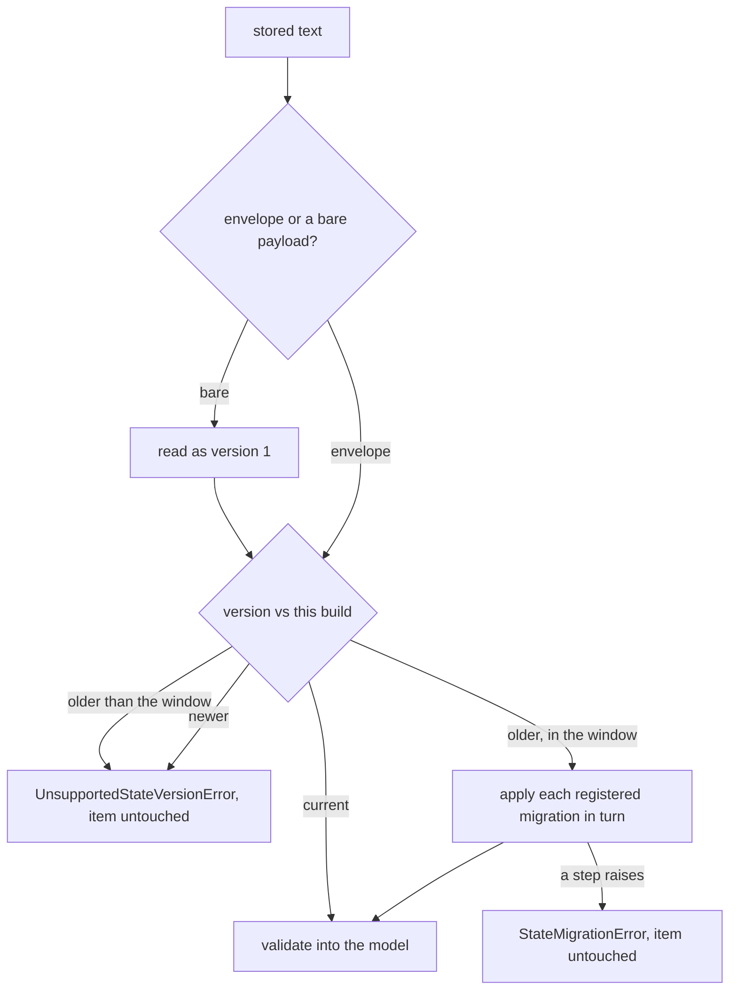

# Versioned persisted state

A session, a run, a checkpoint and a queue item outlive the build that wrote them. During a
rolling deploy two builds read and write the same records at once, and after an upgrade the
oldest in-flight checkpoint was written by the previous minor. A rename that goes straight
into the model makes that checkpoint unreadable, and the symptom is a run that never resumes
rather than an error anyone can trace.

So the kit does not store a model. It stores an envelope naming what the record is, which
version of the format wrote it, and the payload — and reads it back through a registry that
knows how to walk one version to the next.



## Writing and reading

```python
from tesserix_adk.core import StateKind, packed, unpacked

blob = packed(record, kind=StateKind.CHECKPOINT)
record = unpacked(blob, Checkpoint, kind=StateKind.CHECKPOINT)
```

The kit's own stores already go through these, so `RedisStateStore`, `SqlStateStore`, both
checkpoint stores and both queues write envelopes without a consumer doing anything.

| Name | What it is |
|---|---|
| `StateKind` | The four things the kit persists: `session`, `run`, `checkpoint`, `work_item` |
| `CURRENT_VERSIONS` | The format version this build writes, per kind |
| `SUPPORTED_WINDOW` | How many versions back a reader still accepts. Two |
| `Envelope` | `kind`, `schema_version`, `payload`, `written_by`, plus `digest()` |
| `StateRegistry` | Where migrations are registered and where `upgraded()` applies them |
| `StateMigration` | One adjacent step: `kind`, `from_version`, `to_version`, `migrate` |
| `canonical_json` | Stable key order, tagged datetimes and decimals, no NaN |
| `revived` | The inverse: tagged values back to `datetime` and `Decimal` |

## Canonical serialisation

Keys are sorted, separators are tight, non-ASCII stays as itself, and `NaN` is refused
rather than written as a token no other JSON reader accepts. A `datetime` is written as
`{"$datetime": "..."}` and a `Decimal` as `{"$decimal": "..."}`, so money round-trips as the
decimal it was and never through a float. Integers are integers: a token counter past 2^53
comes back exactly. Two equal records therefore serialise to the same bytes, and
`Envelope.digest()` over those bytes is a stable content hash.

## Rolling deploys

Compatibility inside a major is additive and optional only, and a field name is never
reused for a different meaning. Reading is symmetrical about that rule:

- A record written by an older build in the window is migrated on read, step by step.
- A record written by a *newer* build raises `UnsupportedStateVersionError` naming both
  versions. Nothing is coerced and nothing is written back, so a newer worker still claims
  it — a partially rolled-back deploy stalls one item rather than corrupting it.
- A field this build does not declare is not dropped. `Envelope.preserved(model)` returns
  those fields, along with declared fields holding an enum value this build has no member
  for, and `packed(..., preserved=...)` writes them back untouched.

```python
envelope = Envelope.from_json(blob)
record = envelope.opened(RunRecord)
blob = packed(record.model_copy(update={"state": "done"}), kind=StateKind.RUN,
              preserved=envelope.preserved(RunRecord))
```

## Registering a migration

```python
from tesserix_adk.core import STATE_REGISTRY, StateMigration

STATE_REGISTRY.register(
    StateMigration(kind="orders", from_version=1, to_version=2,
                   migrate=lambda payload: {**payload, "currency": "EUR"})
)
```

Steps must be adjacent and registered once; anything else is a `ConfigurationError` at
registration rather than a gap discovered on the first old record. Migrations run against a
copy, so a step that raises leaves the stored item exactly as it was and surfaces as
`StateMigrationError` naming the kind and the step.

## Deprecation policy

A format change ships in the same release as its migration, and the previous version stays
readable for at least one minor. `SUPPORTED_WINDOW` is what that promise is worth: two
versions back. Older than that refuses with remediation — drain or replay the record through
an intermediate release — rather than guessing at a shape nobody kept the code for.

`tests/fixtures/state/` holds a real envelope of every kind from every release so far, and
the suite reads each one with the current reader. An accidental breaking change fails the
build instead of a deploy.

## Known limitations

- Pre-envelope payloads are read as version 1 by shape. A bare JSON object that happens to
  carry `kind`, `schema_version` and `payload` keys of its own would be mistaken for an
  envelope, which no record the kit ever wrote does.
- Migrations are per kind and per adjacent step. A change that has to look at two records at
  once is a platform job, not a read-time migration.
- Unknown fields are preserved only where the caller passes them back on write. A consumer
  storing records itself has to carry `preserved` through its own read-modify-write.
- The registry is a process-level object. Two builds disagreeing about what version 3 means
  is a release discipline problem, and no code here can detect it.
